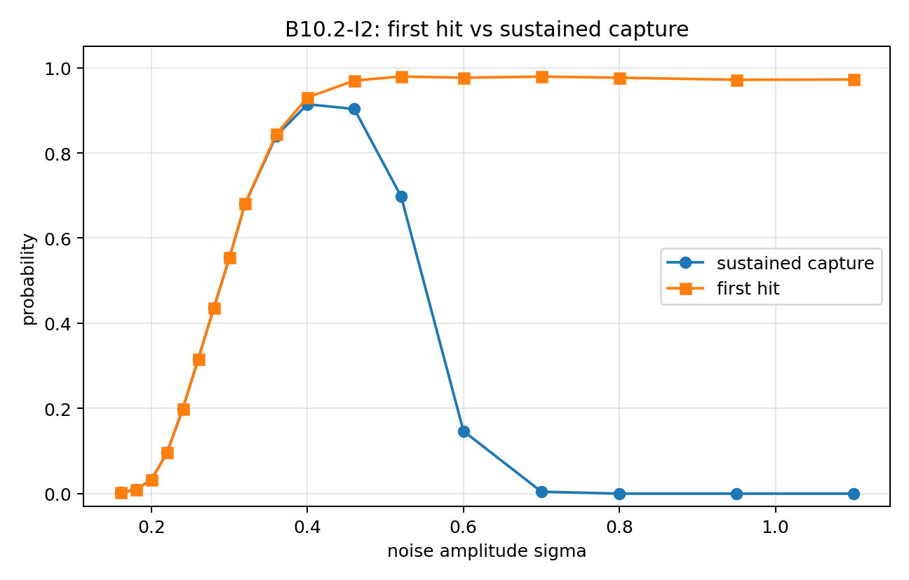

# Boundary Information Geometry (BIG)

> 🇯🇵 **日本語概要 / Japanese overview**
> 境界情報幾何学（BIG）の日本語での概要はこちら：
> [docs/BIG_overview_ja.md](docs/BIG_overview_ja.md)
>
> 境界情報幾何学（BIG）は、「境界」を個体性・安定性・非同化・共鳴・継承の中心に置く、発展中の数理・数値研究プログラムです。

---

**Boundary Information Geometry (BIG)** is a boundary-centered research programme developed by **Jun Lucis**.

BIG starts from a simple organizing idea:

> Stable individuality is not only a property of what is inside a system.
> It is also formed, maintained, and transformed by boundaries.

In BIG, boundaries are not passive edges. They are active structures that separate, preserve, mediate, deform, reconnect, fail, or transmit memory-like structure across interaction.

BIG is **not presented as a completed physical theory**. It is a developing framework of reduced mathematical models, numerical experiments, structural comparisons, and cautious exploratory extensions.

---

## How to navigate this repository

Recommended reading order:

```text
README.md
    -> papers/        main B-series explanations
    -> figures/       visual assets referenced by README and papers
    -> docs/          terminology, limitations, publication map, Japanese overview
    -> Zenodo         PDFs, raw data, full figures, reproducibility archives
```

In this repository:

* `papers/` is the **main entry point** for each B-series.
* `figures/` stores representative figures used by README files and documentation.
* `docs/` contains reference material such as terminology, limitations, and publication maps.
* Zenodo remains the archive for full papers, raw datasets, high-resolution figures, and reproducibility packages.

---

## Documentation

Key overview and reference documents:

* 🇯🇵 **Japanese overview:** [docs/BIG_overview_ja.md](docs/BIG_overview_ja.md)
* **Publication map:** [docs/publication_map.md](docs/publication_map.md)
* **Limitations and scope:** [docs/limitations.md](docs/limitations.md)
* **Terminology:** [docs/terminology.md](docs/terminology.md)

Additional summary notes:

* **B7 to B8 summary:** [docs/B7_to_B8_summary.md](docs/B7_to_B8_summary.md)
* **B8 anisotropic separatrix summary:** [docs/B8_anisotropic_separatrix_summary.md](docs/B8_anisotropic_separatrix_summary.md)

---

## Core idea

The central intuition of BIG is that individuality and persistence require **non-assimilative boundaries**.

A boundary must be strong enough to preserve distinction, but not so closed that interaction becomes impossible. Stable systems may therefore be understood as structures that:

* maintain a boundary,
* resist total assimilation,
* interact across the boundary,
* reorganize under stress,
* and sometimes preserve memory through transformation.

This idea is explored through reduced mathematical motifs such as compact boundary layers, quadratic landing, quartic-gradient stiffness, finite-time separatrix thresholds, boundary-energy competition, finite-noise capture, and hidden-depth inheritance.

---

## Core mathematical motifs

### Boundary-layer formation

A scalar field may form compact or compact-like boundary layers rather than diffusing into a homogeneous bulk. In several numerical settings, the local boundary profile exhibits a quadratic landing form,

$$
\phi(s) \sim A s^\nu,\qquad \nu \approx 2,
$$

where (s) is the distance from the boundary.

### Quartic-gradient boundary stiffness

A recurring BIG term is a quartic-gradient contribution,

$$
|\nabla \phi|^4,
$$

which acts as a nonlinear boundary stiffness or non-assimilative tension.

### Finite-time separatrix

Some BIG models show a finite-amplitude threshold separating survival-like behavior from runaway-like behavior over a fixed observation time. Boundary geometry, especially anisotropy, can shift this threshold.

### Boundary energy versus nonlocal repulsion

A minimal geometric energy of the form

$$
E(\Omega;\lambda)=\sigma P(\Omega)+\lambda C(\Omega)
$$

can generate a fission-like metastable landscape: compact state, finite pinch barrier, and separated branch.

### Finite-noise resonance locking

In dynamic boundary models, noise can play a constructive and destructive role. Too little noise may fail to activate an internal channel; intermediate noise can enable sustained capture; excessive noise can destroy sustained locking.

### Hidden-depth inheritance

Post-capture states need not collapse into total assimilation. A hidden-depth state can retain multiple parent-like memories if inheritance coupling is sufficiently strong.

---

## B-series overview

| Series | Main role                                                               | Main entry                                                                   |
| ------ | ----------------------------------------------------------------------- | ---------------------------------------------------------------------------- |
| B3--B4 | Compact-support-like boundary layers and quadratic landing              | [papers/BIG-B3](papers/BIG-B3)                                |
| B7     | Persistence of free-boundary exponent near runaway transition           | [papers/B7_boundary_exponent](papers/B7_boundary_exponent)                   |
| B8     | Boundary anisotropy and finite-time separatrix thresholds               | [papers/B8_finite_time_separatrix](papers/B8_finite_time_separatrix)         |
| B9     | Fission-like metastability from boundary cost versus nonlocal repulsion | [papers/B9_fission_like_metastability](papers/B9_fission_like_metastability) |
| B10    | Stochastic-resonance-like finite-noise sustained capture                | [papers/B10_finite_noise_capture](papers/B10_finite_noise_capture)           |
| B11    | Post-capture hidden-depth inheritance versus assimilation               | [papers/B11_hidden_depth_inheritance](papers/B11_hidden_depth_inheritance)   |
| B12    | Unified boundary dynamics connecting B9, B10, and B11                   | [papers/B12_unified_boundary_dynamics](papers/B12_unified_boundary_dynamics) |

The later B-series, especially B9--B12, was not originally designed to reproduce any specific physical phenomenon such as nuclear fission, nuclear fusion, biological inheritance, or material-interface dynamics. These reduced models emerged from the internal boundary logic of BIG.

The structural correspondences should therefore be read as **model-level structural convergences**, not as direct quantitative equivalences.

---

# Visual guide to B9--B12

The following figures are shown here as orientation markers.
For the explanatory text, read the corresponding folder under `papers/`.
For full figure lists, see the corresponding folder under `figures/`.

---

## BIG-B9: Fission-like metastability


**Main idea:**
Boundary cost and nonlocal repulsion can generate a fission-like metastable energy landscape in a reduced geometric model.

```text
compact state
    -> finite pinch barrier
    -> separated branch
```

**Main entry:**
[papers/B9_fission_like_metastability](papers/B9_fission_like_metastability)

**Figures:**
[figures/B9](figures/B9)

**Scope:**
B9 is a reduced boundary-energy model and macroscopic structural comparison. It is not a quantitative nuclear-fission calculation.

---

## BIG-B10: Finite-noise sustained capture



**Main idea:**
Boundary capture is not the same as first contact. In the reduced B10 model, sustained capture appears within a finite-noise window.

```text
first hit != sustained capture
```

**Main entry:**
[papers/B10_finite_noise_capture](papers/B10_finite_noise_capture)

**Figures:**
[figures/B10](figures/B10)

**Scope:**
B10 is a reduced dynamic model of stochastic-resonance-like capture. It is not a quantitative nuclear-fusion theory.

---

## BIG-B11: Hidden-depth inheritance


**Main idea:**
After capture, a state may collapse into assimilation or preserve multiple parent-like memories through hidden-depth inheritance in a reduced stochastic landscape.

```text
assimilation
or
hidden-depth inheritance
```

**Main entry:**
[papers/B11_hidden_depth_inheritance](papers/B11_hidden_depth_inheritance)

**Figures:**
[figures/B11](figures/B11)

**Scope:**
B11 treats inheritance structurally within a reduced hidden-state model. It is not a quantitative theory of biological inheritance or real energy release.

---

## BIG-B12: Unified boundary dynamics


**Main idea:**
B12 integrates boundary approach, finite-noise R-lock, and hidden-depth inheritance into one reduced boundary-dynamical framework.

```text
boundary approach
    -> noise-assisted R-lock
    -> hidden-depth inheritance
```

A strict B12 full-success event requires:

```text
full success = strict R-lock AND hidden-depth inheritance
```

**Main entry:**
[papers/B12_unified_boundary_dynamics](papers/B12_unified_boundary_dynamics)

**Figures:**
[figures/B12](figures/B12)

**Scope:**
B12 is a reduced variational-stochastic model. It is not a completed physical unification theory.

---

## Development path

The current BIG development can be read as a sequence of increasingly coupled boundary questions:

```text
boundary formation
    -> local boundary regularity
    -> finite-time stability thresholds
    -> separation / fission-like branching
    -> finite-noise capture
    -> post-capture inheritance
    -> unified boundary dynamics
```

This path is not a claim that all domains share the same physics.
It is a research programme for testing whether boundary-centered reduced models can reveal recurring structural motifs across different systems.

---

## Important limitations

BIG is a developing mathematical and numerical research programme. The current models are intentionally reduced.

In particular:

* BIG-B9 is not a quantitative theory of nuclear fission.
* BIG-B10 is not a quantitative theory of nuclear fusion.
* BIG-B11 is not a quantitative theory of biological inheritance, nuclear fusion, or real energy release.
* BIG-B12 is not a completed physical unification theory.
* Reported thresholds are model-level numerical results and depend on the adopted equations, parameters, discretization, and event definitions.
* Applications to nuclear physics, materials science, biology, cognition, AI, or cosmology require domain-specific extensions before any quantitative claim can be made.

The current value of BIG is not in claiming final physical explanation, but in providing a boundary-centered language in which stability, separation, capture, memory, and non-assimilation can be studied together.

For details, see:

[docs/limitations.md](docs/limitations.md)

---

## Structural comparison and future adaptation

Some BIG models have shown structural alignment with established patterns in other fields.

For example, B9 was not built as a nuclear model, but its boundary-cost versus nonlocal-repulsion landscape naturally resembles the macroscopic surface-versus-Coulomb competition used in fission-barrier intuition. The comparison remains structural and qualitative.

This motivates a broader research direction:

> Test whether boundary-centered reduced models can be adapted to other fields where stability, interface geometry, separation, capture, memory, anisotropy, or failure thresholds are central.

Possible areas for future comparison include:

* interface and free-boundary problems,
* phase separation,
* membrane dynamics,
* material-interface failure,
* finite-amplitude stability,
* stochastic resonance,
* biological fusion and inheritance as structural analogies,
* AI individuality and non-assimilative interaction,
* and other systems where boundaries are active rather than passive.

---

## Zenodo records

A more detailed publication map is maintained here:

[docs/publication_map.md](docs/publication_map.md)

Current and planned entries include:

| Series | Title                                                                                              | DOI / record                            |
| ------ | -------------------------------------------------------------------------------------------------- | --------------------------------------- |
| B7     | Persistence of the Free-Boundary Exponent Across a Runaway Transition                              | https://doi.org/10.5281/zenodo.20603601                           |
| B8     | Boundary anisotropy and finite-time separatrix thresholds                                          | https://zenodo.org/records/20645317     |
| B9     | Minimal boundary-energy model for fission-like metastability                                       | https://doi.org/10.5281/zenodo.20799131 |
| B10    | Stochastic-Resonance-Like Fusion Capture in a Dynamic Boundary Model                               | https://doi.org/10.5281/zenodo.20819427 |
| B11    | Post-Fusion Boundary Inheritance and Non-Assimilative Stabilization                                | https://doi.org/10.5281/zenodo.20828439 |
| B12    | Unified Boundary Dynamics with Finite-Noise Resonance Locking and Post-Fusion Boundary Inheritance | https://doi.org/10.5281/zenodo.20872005                         |

---

## Repository structure

Current intended organization:

```text
BIG-theory/
├── README.md
├── docs/
│   ├── BIG_overview_ja.md
│   ├── publication_map.md
│   ├── terminology.md
│   └── limitations.md
├── papers/
│   ├── B7_boundary_exponent/
│   ├── B8_finite_time_separatrix/
│   ├── B9_fission_like_metastability/
│   ├── B10_finite_noise_capture/
│   ├── B11_hidden_depth_inheritance/
│   └── B12_unified_boundary_dynamics/
├── figures/
│   ├── B9/
│   ├── B10/
│   ├── B11/
│   └── B12/
├── data/
└── code/
```

Large raw datasets should preferably be archived on Zenodo. GitHub should contain lightweight summary tables, representative figures, reproducibility scripts, and links to DOI records.

---

## Recommended citation

For general discussion of the BIG research programme, cite the GitHub repository:

```text
Lucis, J. Boundary Information Geometry (BIG). GitHub repository.
https://github.com/Jun-Lucis/BIG-theory
```

For specific numerical or structural claims, please cite the corresponding Zenodo DOI.

---

## Author

**Jun Lucis**
Independent researcher
Boundary Information Geometry (BIG)

Repository:
https://github.com/Jun-Lucis/BIG-theory
