# Boundary Information Geometry (BIG)

> 🇯🇵 **日本語概要 / Japanese overview**
> 境界情報幾何学（BIG）の日本語での概要はこちら：
> [docs/BIG_overview_ja.md](docs/BIG_overview_ja.md)
>
> 境界情報幾何学（BIG）は、「境界」を個体性・安定性・非同化・共鳴・継承の中心に置く、発展中の数理・数値研究プログラムです。

---

**Boundary Information Geometry (BIG)** is a boundary-centered research programme developed by **Jun Lucis**.

BIG starts from a simple organizing idea:

> Stable individuality is not only a property of what is inside a system.
> It is also formed, maintained, and transformed by boundaries.

In BIG, boundaries are not passive edges. They are active structures that separate, preserve, mediate, deform, reconnect, fail, or transmit memory-like structure across interaction.

BIG is **not presented as a completed physical theory**. It is a developing framework of reduced mathematical models, numerical experiments, structural comparisons, and cautious exploratory extensions.

---

## How to navigate this repository

Recommended reading order:

```text
README.md
    -> papers/        main B-series explanations
    -> figures/       visual assets referenced by README and papers
    -> docs/          terminology, limitations, publication map, Japanese overview
    -> Zenodo         PDFs, raw data, full figures, reproducibility archives
```

In this repository:

* `papers/` is the **main entry point** for each B-series.
* `figures/` stores representative figures used by README files and documentation.
* `docs/` contains reference material such as terminology, limitations, and publication maps.
* Zenodo remains the archive for full papers, raw datasets, high-resolution figures, and reproducibility packages.

---

## Documentation

Key overview and reference documents:

* 🇯🇵 **Japanese overview:** [docs/BIG_overview_ja.md](docs/BIG_overview_ja.md)
* **Publication map:** [docs/publication_map.md](docs/publication_map.md)
* **Research status map — B3 to B23:** [docs/research_status_map_B3_B23.md](docs/research_status_map_B3_B23.md)
* **B24–B25 Phase-I status update:** [docs/research_status_update_B24_B25.md](docs/research_status_update_B24_B25.md)
* **B25 Phase-II status update:** [docs/research_status_update_B25_phaseII.md](docs/research_status_update_B25_phaseII.md)
* **B26 terminal status update:** [docs/research_status_update_B26.md](docs/research_status_update_B26.md)
* 🇯🇵 **研究状況マップ — B3からB23まで:** [docs/research_status_map_B3_B23_ja.md](docs/research_status_map_B3_B23_ja.md)
* 🇯🇵 **B24–B25 Phase-I 研究状況更新:** [docs/research_status_update_B24_B25_ja.md](docs/research_status_update_B24_B25_ja.md)
* 🇯🇵 **B25 Phase-II 研究状況更新:** [docs/research_status_update_B25_phaseII_ja.md](docs/research_status_update_B25_phaseII_ja.md)
* 🇯🇵 **B26 研究状況更新:** [docs/research_status_update_B26_ja.md](docs/research_status_update_B26_ja.md)
* **Limitations and scope:** [docs/limitations.md](docs/limitations.md)
* **Terminology:** [docs/terminology.md](docs/terminology.md)

Additional summary notes:

* **B7 to B8 summary:** [docs/B7_to_B8_summary.md](docs/B7_to_B8_summary.md)
* **B8 anisotropic separatrix summary:** [docs/B8_anisotropic_separatrix_summary.md](docs/B8_anisotropic_separatrix_summary.md)

---

## Current research status

A compact evidence map separating **model-level results** from **open hypotheses** is available here:

- [BIG Research Status Map — B3 to B23](docs/research_status_map_B3_B23.md)
- [B24–B25 Phase-I status update](docs/research_status_update_B24_B25.md)
- [B25 Phase-II status update](docs/research_status_update_B25_phaseII.md)
- [B26 terminal status update](docs/research_status_update_B26.md)
- [日本語版 — B3からB23まで、何が成立し何がまだ仮説か](docs/research_status_map_B3_B23_ja.md)
- [B24–B25 Phase-I 日本語更新](docs/research_status_update_B24_B25_ja.md)
- [B25 Phase-II 日本語更新](docs/research_status_update_B25_phaseII_ja.md)
- [B26 日本語更新](docs/research_status_update_B26_ja.md)

**Formal status-note DOI (through B23):** https://doi.org/10.5281/zenodo.22939024

**B24–B25 Phase-I preprint DOI:** https://doi.org/10.5281/zenodo.22956894

**B25 Phase-II preprint DOI:** https://doi.org/10.5281/zenodo.22967474

**B26 preprint DOI:** https://doi.org/10.5281/zenodo.22972985

Current one-sentence status:

> **B24 retained multiple native boundary classes. B25 then built a prospective transfer hierarchy culminating in a fixed-coefficient perimeter closure on held-out ellipse targets. B26 independently localized the representative-level topology transition and then tested new topology-straddling two-center targets: all six terminal cases were numerically valid and the topology gate was realized, but the frozen fixed coefficient failed prospectively (median error 42.91%, maximum 44.79%), resolving a finite-resolution geometry-transfer boundary rather than a universal sigma-P law.**

---

## Core idea

The central intuition of BIG is that individuality and persistence require **non-assimilative boundaries**.

A boundary must be strong enough to preserve distinction, but not so closed that interaction becomes impossible. Stable systems may therefore be understood as structures that:

* maintain a boundary,
* resist total assimilation,
* interact across the boundary,
* reorganize under stress,
* and sometimes preserve memory through transformation.

This idea is explored through reduced mathematical motifs such as compact boundary layers, quadratic landing, quartic-gradient stiffness, finite-time separatrix thresholds, boundary-energy competition, finite-noise capture, hidden-depth inheritance, observation-like state selection, boundary history, moving-boundary readout, boundary-core channels, finite-time response geometry, local kinematic closure, prospective finite-resolution geometry of moving response boundaries, cross-branch short-horizon geometric prediction, cross-sector source auditing, and predictive boundary-functional transfer.

---

## Core mathematical motifs

### Boundary-layer formation

A scalar field may form compact or compact-like boundary layers rather than diffusing into a homogeneous bulk. In several numerical settings, the local boundary profile exhibits a quadratic landing form,

$$
\phi(s) \sim A s^\nu,\qquad \nu \approx 2,
$$

where (s) is the distance from the boundary.

### Quartic-gradient boundary stiffness

A recurring BIG term is a quartic-gradient contribution,

$$
|\nabla \phi|^4,
$$

which acts as a nonlinear boundary stiffness or non-assimilative tension.

### Finite-time separatrix

Some BIG models show a finite-amplitude threshold separating survival-like behavior from runaway-like behavior over a fixed observation time. Boundary geometry, especially anisotropy, can shift this threshold.

### Boundary energy versus nonlocal repulsion

A minimal geometric energy of the form

$$
E(\Omega;\lambda)=\sigma P(\Omega)+\lambda C(\Omega)
$$

can generate a fission-like metastable landscape: compact state, finite pinch barrier, and separated branch.

### Finite-noise resonance locking

In dynamic boundary models, noise can play a constructive and destructive role. Too little noise may fail to activate an internal channel; intermediate noise can enable sustained capture; excessive noise can destroy sustained locking.

### Hidden-depth inheritance

Post-capture states need not collapse into total assimilation. A hidden-depth state can retain multiple parent-like memories if inheritance coupling is sufficiently strong.

---

## B-series overview

| Series | Main role | Main entry |
| --- | --- | --- |
| B3--B4 | Compact-support-like boundary layers and quadratic landing | [B3.1](papers/BIG-B3.1) · [B4.1](papers/BIG-B4.1) · [B4.3](papers/BIG-B4.3) |
| B7 | Persistence of free-boundary exponent near runaway transition | [papers/B7_boundary_exponent](papers/B7_boundary_exponent) |
| B8 | Boundary anisotropy and finite-time separatrix thresholds | [papers/B8_finite_time_separatrix](papers/B8_finite_time_separatrix) |
| B9 | Fission-like metastability from boundary cost versus nonlocal repulsion | [papers/B9_fission_like_metastability](papers/B9_fission_like_metastability) |
| B10 | Stochastic-resonance-like finite-noise sustained capture | [papers/B10_finite_noise_capture](papers/B10_finite_noise_capture) |
| B11 | Post-capture hidden-depth inheritance versus assimilation | [papers/B11_hidden_depth_inheritance](papers/B11_hidden_depth_inheritance) |
| B12 | Unified boundary dynamics connecting B9, B10, and B11 | [papers/B12_unified_boundary_dynamics](papers/B12_unified_boundary_dynamics) |
| B13 | Boundary folding and observation-like state selection | [papers/B13_boundary_folding_observation](papers/B13_boundary_folding_observation) |
| B13.1 | Rotated-basis observation and empirical selection kernel | [papers/B13_1_rotated_basis_observation](papers/B13_1_rotated_basis_observation) |
| B14 | Boundary history and lineage-level trace persistence | [papers/B14_boundary_history](papers/B14_boundary_history) |
| B15 | Operator representation of observation traces and history | [papers/B15_operator_representation](papers/B15_operator_representation) |
| B16 | Memory-bearing moving free boundaries | [papers/B16_memory_bearing_free_boundaries](papers/B16_memory_bearing_free_boundaries) |
| B17 | Stored history versus locally readable history | [papers/B17_readable_history](papers/B17_readable_history) |
| B18 | Boundary-dependent readout and interface-core path exposure | [papers/B18_boundary_readout_operators](papers/B18_boundary_readout_operators) |
| B19 | Direction-dependent boundary-core channel diagnostics | [papers/B19_boundary_core_channels](papers/B19_boundary_core_channels) |
| B20 | Operator-generated finite-window response boundaries | [papers/B20_response_boundaries](papers/B20_response_boundaries) |
| B21 | Local kinematic closure of moving response boundaries | [papers/B21_local_kinematic_closure](papers/B21_local_kinematic_closure) |
| B22 | Prospective finite-resolution geometry of response boundaries | [papers/B22_prospective_local_geometry](papers/B22_prospective_local_geometry) |
| B23 | Cross-branch short-horizon geometric prediction | [papers/B23_cross_branch_geometric_prediction](papers/B23_cross_branch_geometric_prediction) |
| B24–B25 | Cross-sector audit and predictive boundary-functional transfer | [papers/B24_B25_predictive_boundary_functional_transfer](papers/B24_B25_predictive_boundary_functional_transfer) |
| B26 | Geometry-transfer boundary of fixed-coefficient perimeter closure | [papers/B26_topology_realized_fixed_sigma_transfer](papers/B26_topology_realized_fixed_sigma_transfer) |

The later B-series, especially B9--B12, was not originally designed to reproduce any specific physical phenomenon such as nuclear fission, nuclear fusion, biological inheritance, or material-interface dynamics. These reduced models emerged from the internal boundary logic of BIG.

The structural correspondences should therefore be read as **model-level structural convergences**, not as direct quantitative equivalences.

---

# Visual guide to B9--B12

The following figures are shown here as orientation markers.
For the explanatory text, read the corresponding folder under `papers/`.
For full figure lists, see the corresponding folder under `figures/`.

---

## BIG-B9: Fission-like metastability

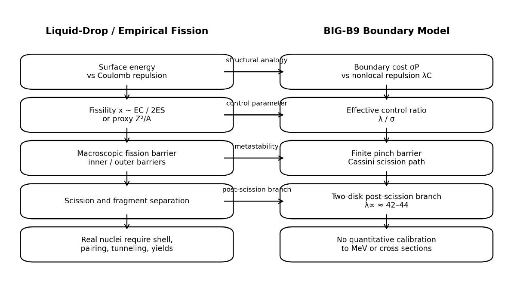

**Main idea:**
Boundary cost and nonlocal repulsion can generate a fission-like metastable energy landscape in a reduced geometric model.

```text
compact state
    -> finite pinch barrier
    -> separated branch
```

**Main entry:**
[papers/B9_fission_like_metastability](papers/B9_fission_like_metastability)

**Figures:**
[figures/B9](figures/B9)

**Scope:**
B9 is a reduced boundary-energy model and macroscopic structural comparison. It is not a quantitative nuclear-fission calculation.

---

## BIG-B10: Finite-noise sustained capture

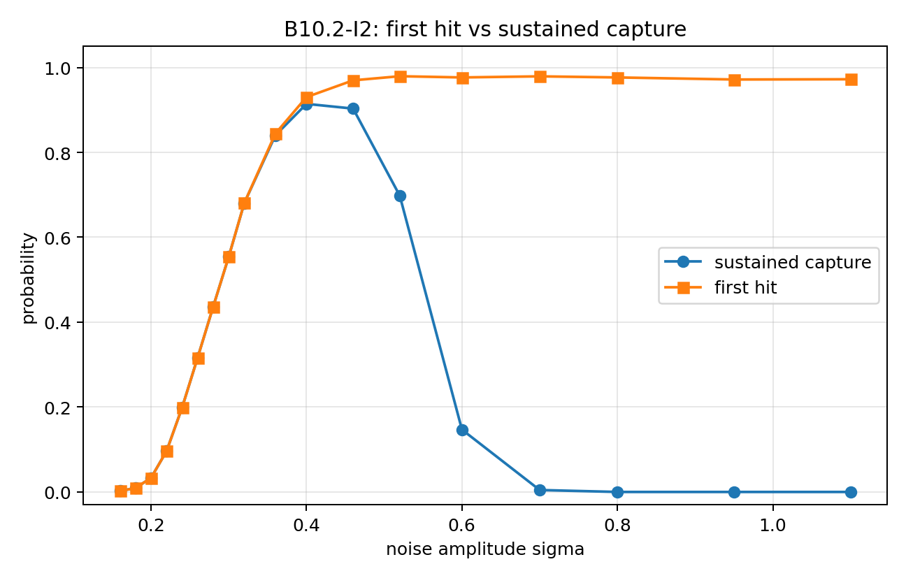

**Main idea:**
Boundary capture is not the same as first contact. In the reduced B10 model, sustained capture appears within a finite-noise window.

```text
first hit != sustained capture
```

**Main entry:**
[papers/B10_finite_noise_capture](papers/B10_finite_noise_capture)

**Figures:**
[figures/B10](figures/B10)

**Scope:**
B10 is a reduced dynamic model of stochastic-resonance-like capture. It is not a quantitative nuclear-fusion theory.

---

## BIG-B11: Hidden-depth inheritance

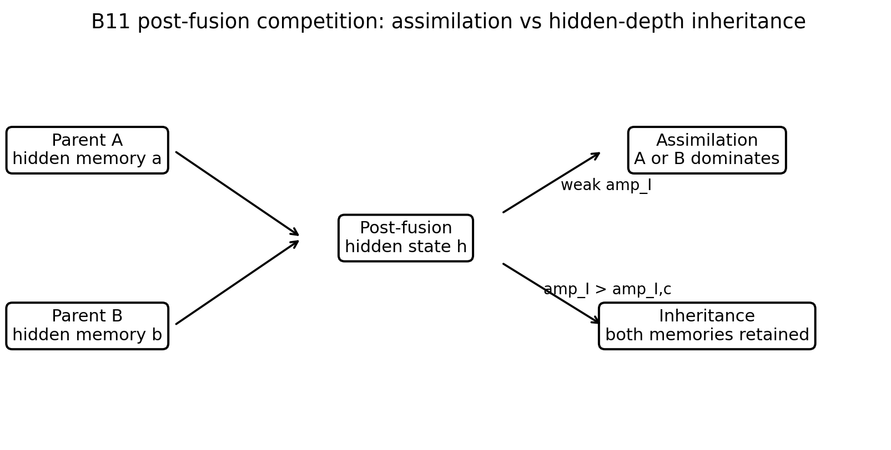

**Main idea:**
After capture, a state may collapse into assimilation or preserve multiple parent-like memories through hidden-depth inheritance in a reduced stochastic landscape.

```text
assimilation
or
hidden-depth inheritance
```

**Main entry:**
[papers/B11_hidden_depth_inheritance](papers/B11_hidden_depth_inheritance)

**Figures:**
[figures/B11](figures/B11)

**Scope:**
B11 treats inheritance structurally within a reduced hidden-state model. It is not a quantitative theory of biological inheritance or real energy release.

---

## BIG-B12: Unified boundary dynamics

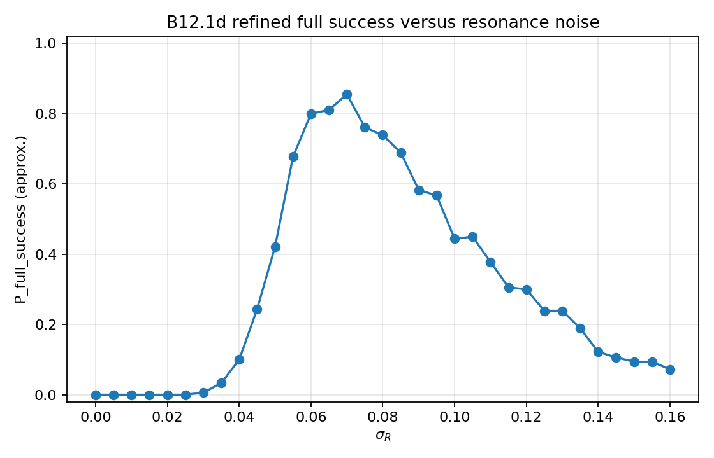

**Main idea:**
B12 integrates boundary approach, finite-noise R-lock, and hidden-depth inheritance into one reduced boundary-dynamical framework.

```text
boundary approach
    -> noise-assisted R-lock
    -> hidden-depth inheritance
```

A strict B12 full-success event requires:

```text
full success = strict R-lock AND hidden-depth inheritance
```

**Main entry:**
[papers/B12_unified_boundary_dynamics](papers/B12_unified_boundary_dynamics)

**Figures:**
[figures/B12](figures/B12)

**Scope:**
B12 is a reduced variational-stochastic model. It is not a completed physical unification theory.

---


# Visual guide to B13--B23

The later B-series shifts from state selection and history to moving-boundary readout and finite-window response geometry. The figures below are representative diagnostics; the Zenodo records remain the canonical source for complete results and reproducibility material.

---

## BIG-B13: Observation-like state selection

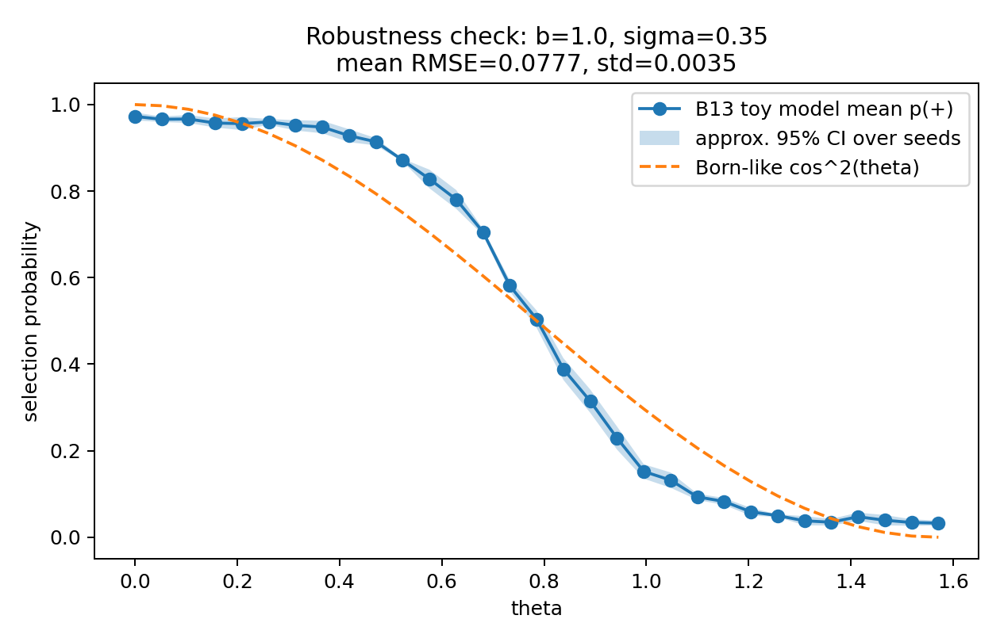

**Main idea:** Boundary-mediated coupling can bias hidden-depth basin selection in the reduced B13 model. Born-like curves are used only as empirical references; B13 does not derive quantum measurement or the Born rule.

**Main entry:** [papers/B13_boundary_folding_observation](papers/B13_boundary_folding_observation)

---

## BIG-B14--B15: Boundary history and operator representation

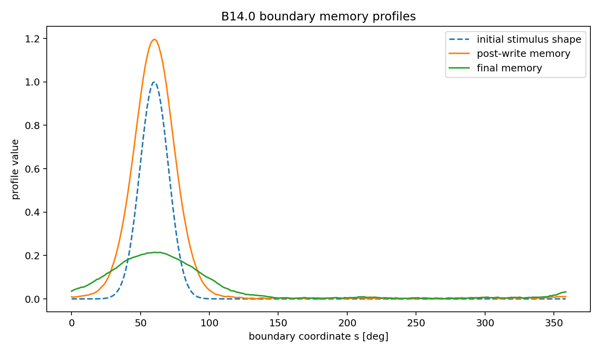

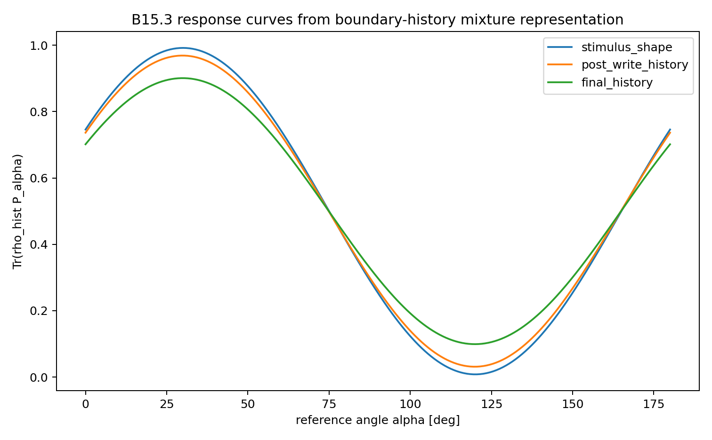

**Main idea:** History becomes an explicit state variable that can be written, relaxed, partitioned, propagated, and represented through reduced state-update operators.

**Main entries:** [B14](papers/B14_boundary_history) · [B15](papers/B15_operator_representation)

---

## BIG-B16--B18: From retained history to readable history

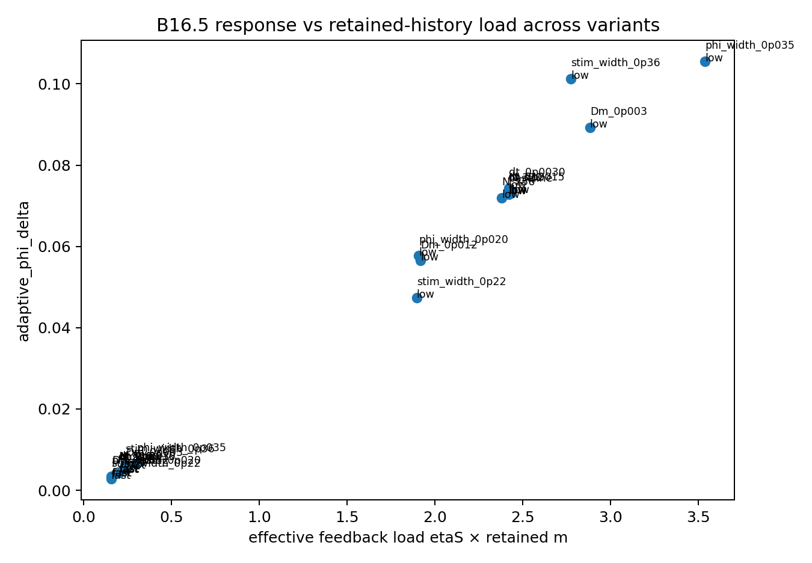

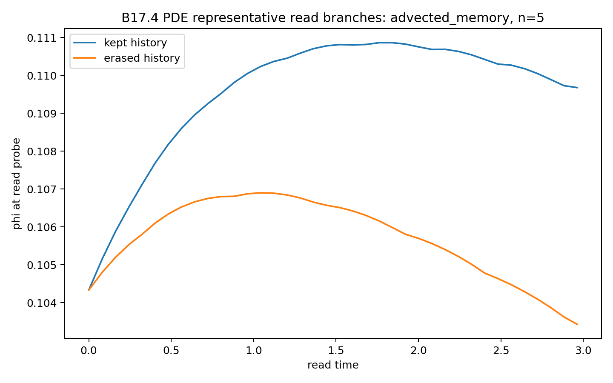

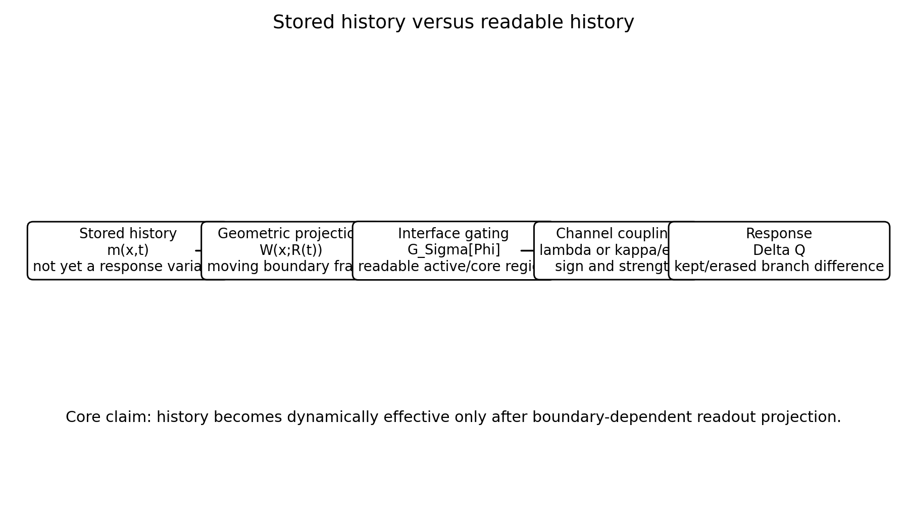

**Main idea:** Retaining a history field is not sufficient for later response. B17 separates stored from locally readable history, and B18 extends this to boundary-dependent, path-integrated interface/core exposure.

```text
stored history
    -> locally readable history
    -> path / interface-core exposure
    -> later response
```

**Main entries:** [B16](papers/B16_memory_bearing_free_boundaries) · [B17](papers/B17_readable_history) · [B18](papers/B18_boundary_readout_operators)

---

## BIG-B19--B20: Boundary-core channels and response geometry

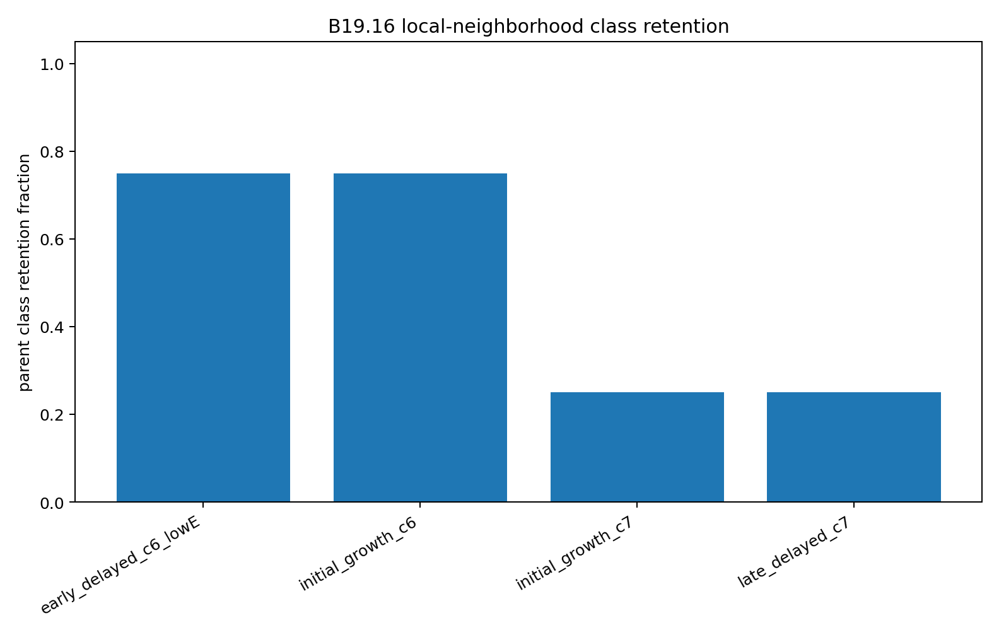

**Main idea:** B19 finds direction-dependent boundary-core channel organization in finite synthetic divergence-free vorticity families. B20 then defines a finite-window response function

$
F_T(P)=Z[U_T(P)]-Z[P]
$

and studies its zero set $\mathcal{B}_T$ as an operator-generated response boundary in parameter space.

B20.6 prospectively scanned frozen parameter-space trajectories. In the archived scan, one trajectory (d03) produced a sign-changing bracket over $s\in[1.875,2.0]$, which was subsequently refined by a frozen bisection procedure. This is evidence for a crossing in that tested trajectory, not evidence for a universal separatrix or a Navier--Stokes singularity criterion.

**Main entries:** [B19](papers/B19_boundary_core_channels) · [B20](papers/B20_response_boundaries)

---

## BIG-B21: Local kinematic closure


**Main idea:** B21 follows the motion of the B20 response boundary in the exact normalized four-dimensional B20.5 subspace. For the subspace response gradient $g=\nabla_S F_T$, it tests the local kinematic identity

$
\frac{Dg}{dT}=\partial_T g+H_S\dot P_B.
$

In the frozen terminal E12 test on the synthetic Family-C `r10` branch, the closure residual is **0.1242154%**, below the first-order root-bracket bound of **0.2174844%**, and the prediction--observation angle is **0.0698935 degrees**. No reproducible residual requiring an additional effective boundary-dynamical term was resolved.

B21 does not repair or upgrade the B20.6 finite-distance result: B20.6 remains **INCONCLUSIVE** because only one informative crossing was available.

**Main entry:** [papers/B21_local_kinematic_closure](papers/B21_local_kinematic_closure)

**Scope:** This is a local numerical closure test in one exact normalized synthetic subspace. It is not a new equation of motion, a continuum Hessian-existence theorem, an invariant-manifold result, a physical-space boundary law, a universal separatrix, or a Navier--Stokes blow-up/regularity claim.

---

## BIG-B22: Prospective local geometry

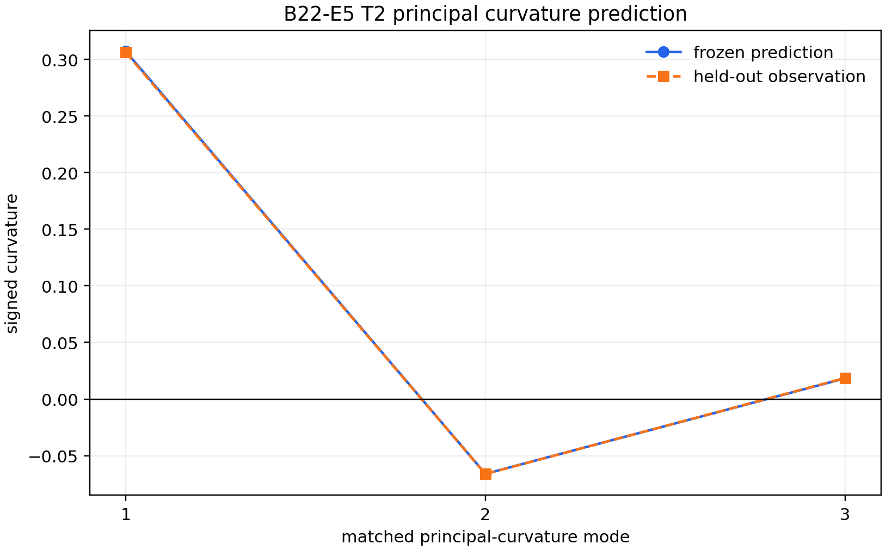

**Main idea:** B22 extends B21 from first-order local kinematic closure to finite-resolution Hessian, curvature, normal-rotation, and principal-direction measurements. After descriptive calibration on `r10`, two sequential forecasts on the reserved `r09` branch were frozen before the corresponding future PDE evaluations.

The first held-out stage obtained an `hess_h2` root error of **0.00488281** and a normal-angle error of **0.21068 degrees**. The second stage, initialized from the observed T1 state, obtained a root error of **0.00878906**, an `hess_h2` normal-angle error of **0.37444 degrees**, a Hessian relative error of **0.0085910**, and a maximum resolved principal-direction error of **0.37895 degrees**. All frozen gates passed and the declared stop rule was reached.

**Main entry:** [papers/B22_prospective_local_geometry](papers/B22_prospective_local_geometry)

**Scope:** These are finite-resolution results in tested synthetic branches. E5 is a sequential observed-T1-to-T2 forecast, not a T0-only two-step-ahead forecast. B22 establishes no continuum curvature theorem, universal boundary law, invariant manifold, physical-space normal, or Navier--Stokes blow-up/regularity result. B20.6 remains **INCONCLUSIVE**.

---

## BIG-B23: Cross-branch short-horizon geometric prediction

**Main idea:** B23 tests whether the B22 local geometric forecast transfers to other predeclared zero-set branches within the same exact normalized four-dimensional Family-C subspace. Four branches over three ray directions were examined for short-horizon position and normal prediction; two designated sentinel branches were also tested for next-step Hessian, principal-curvature, and principal-direction prediction.

At the primary `hess_h2` scale, the four validly evaluated first-stage records had root-midpoint errors from **0.00033604** to **0.00135840** and normal-angle errors from **0.02484** to **0.56706 degrees**. In the later full-geometry tests, `r11_high` had Hessian relative error **0.62884%** and `r12_low` had **0.36319%**; the largest assessable principal-curvature relative errors were **0.98327%** and **2.42220%**, respectively.

The original aggregate plan remains **INCONCLUSIVE** because the symmetric prediction-centered search window was not executable for two endpoint-near branches. The repaired `r12_low` test and the corrected `r09_high` replication are reported as supplementary evidence and are not retroactively counted as original-plan successes.

**Main entry:** [papers/B23_cross_branch_geometric_prediction](papers/B23_cross_branch_geometric_prediction)

**Zenodo record and DOI:** https://doi.org/10.5281/zenodo.22936794

**Scope:** B23 is a finite synthetic, finite-resolution, short-horizon transfer study. It does not establish a universal boundary-motion law, continuum convergence, full-parameter-space invariance, a physical-space interface law, an invariant manifold, or any Navier--Stokes blow-up/regularity result.

---

## BIG-B24–B25: From cross-sector audit to predictive boundary-functional transfer

**Main idea:** B24 asked whether the earlier BIG sectors already shared one substantive operation-preserving mathematical core. Under frozen source-audit and mapping rules, they did not; the retained verdict was `MULTIPLE_BOUNDARY_CLASSES_INDICATED`.

B25 then changed the question from native-operator identity to typed transfer. The first constant-density A-to-B bridge,

```text
J_pred = sigma_1D * P_rep
```

failed under its frozen protocol (`AB_CONSTANT_DENSITY_FAIL`). A retrospective coarea decomposition of the archived profiles identified finite-band level-set geometry and amplitude-transfer effects as systematic contributors.

A replacement level-resolved predictor was frozen before new two-dimensional trajectories:

$
J_{\mathrm{LR,pred}}
=
\kappa_p\phi_{\max}^{(2D)}
\int P(r)g_{1D}(r)^{p-1}\,dr.
$

On nine new resolution/shape combinations, all nine cases were valid; the maximum relative error was **17.76%**, the median error was **9.49%**, the median error improved by **68.15%** relative to the old constant-density comparator, and all frozen fine-resolution stability gates passed. The formal B25.1b verdict was `AB_LEVEL_RESOLVED_BRIDGE_PASS`.

**Main entry:** [papers/B24_B25_predictive_boundary_functional_transfer](papers/B24_B25_predictive_boundary_functional_transfer)

**Phase-I Zenodo DOI:** https://doi.org/10.5281/zenodo.22956894

**Phase-II Zenodo DOI:** https://doi.org/10.5281/zenodo.22967474

Phase II prospectively reduced the Phase-I relation through a parallel-curve form, a narrow-band single-perimeter form, and finally a fixed coefficient calibrated once on a predeclared circular state. The B25.1e primary held-out predictor used only target representative perimeter and passed six new ellipse shape/resolution cases. The subsequent B25.2 two-center geometry-transfer protocol was `IMPLEMENTATION_INVALID`: three coarse cases violated the frozen band-resolution gate and the required connected/disconnected topology span was not realized at fine resolution.

**Scope:** The successful fixed-coefficient result is limited to the tested canonical p=4 finite-resolution ellipse family. Geometry-family and topology transfer remain unresolved. B25 does not establish a universal BIG operator, a continuum theorem, a source-independent sigma P law, the B9 nonlocal term, the complete B9 energy, or external physical validation.


---

## Development path

The current BIG development can be read as a sequence of increasingly coupled boundary questions:

```text
boundary formation
    -> local boundary regularity
    -> finite-time stability thresholds
    -> separation / fission-like branching
    -> finite-noise capture
    -> post-capture inheritance
    -> unified boundary dynamics
    -> observation-like boundary folding
    -> boundary history and operator representation
    -> memory-bearing moving boundaries
    -> boundary-dependent readout
    -> boundary-core channel families
    -> operator-generated finite-time response boundaries
    -> local kinematic closure of moving response geometry
    -> prospective finite-resolution curvature and normal rotation
    -> cross-branch short-horizon geometric prediction
    -> cross-sector common-core audit
    -> predictive boundary-functional transfer
```

This path is not a claim that all domains share the same physics.
It is a research programme for testing whether boundary-centered reduced models can reveal recurring structural motifs across different systems.

---

## Important limitations

BIG is a developing mathematical and numerical research programme. The current models are intentionally reduced.

In particular:

* BIG-B9 is not a quantitative theory of nuclear fission.
* BIG-B10 is not a quantitative theory of nuclear fusion.
* BIG-B11 is not a quantitative theory of biological inheritance, nuclear fusion, or real energy release.
* BIG-B12 is not a completed physical unification theory.
* BIG-B13--B15 do not derive quantum mechanics, the Born rule, consciousness, or biological heredity.
* BIG-B16--B18 are reduced history/readout models, not calibrated models of biological, neural, chemical, or material memory.
* BIG-B19--B23 use finite synthetic vorticity families and finite observation windows; they do not prove Navier--Stokes blow-up or regularity.
* BIG-B21 tests a local finite-dimensional kinematic identity; it does not establish continuum Hessian existence, an invariant manifold, a physical-space boundary law, or a new equation of motion.
* BIG-B22 tests finite-resolution local geometry and sequential held-out forecasts; it does not establish a continuum curvature theorem, a universal boundary-evolution law, or a T0-only two-step forecast.
* BIG-B23 tests cross-branch short-horizon transfer of finite-resolution response geometry; its original aggregate plan remains INCONCLUSIVE and supplementary repaired/corrected runs are not counted as original-plan successes.
* BIG-B24 does not establish one universal common operator across the audited sectors; its frozen cross-sector verdict is **MULTIPLE_BOUNDARY_CLASSES_INDICATED**.
* BIG-B25 Phase I supports a prospective level-resolved transfer relation in the tested canonical p=4 model. Phase II further supports fixed-coefficient perimeter closure within the tested finite-resolution ellipse family, while the first two-center B9-like geometry-transfer protocol is `IMPLEMENTATION_INVALID` and does not establish geometry-family or topology transfer. Earlier negative and inconclusive verdicts remain unchanged.
* Reported thresholds are model-level numerical results and depend on the adopted equations, parameters, discretization, and event definitions.
* Applications to nuclear physics, materials science, biology, cognition, AI, or cosmology require domain-specific extensions before any quantitative claim can be made.

The current value of BIG is not in claiming final physical explanation, but in providing a boundary-centered language in which stability, separation, capture, memory, and non-assimilation can be studied together.

For details, see:

[docs/limitations.md](docs/limitations.md)

---

## Structural comparison and future adaptation

Some BIG models have shown structural alignment with established patterns in other fields.

For example, B9 was not built as a nuclear model, but its boundary-cost versus nonlocal-repulsion landscape naturally resembles the macroscopic surface-versus-Coulomb competition used in fission-barrier intuition. The comparison remains structural and qualitative.

This motivates a broader research direction:

> Test whether boundary-centered reduced models can be adapted to other fields where stability, interface geometry, separation, capture, memory, anisotropy, or failure thresholds are central.

Possible areas for future comparison include:

* interface and free-boundary problems,
* phase separation,
* membrane dynamics,
* material-interface failure,
* finite-amplitude stability,
* stochastic resonance,
* biological fusion and inheritance as structural analogies,
* AI individuality and non-assimilative interaction,
* and other systems where boundaries are active rather than passive.

---

## Zenodo records

A more detailed publication map is maintained here:

[docs/publication_map.md](docs/publication_map.md)

Current entries include:

| Series | Theme | DOI / record |
| --- | --- | --- |
| B7 | Free-boundary exponent across runaway transition | https://doi.org/10.5281/zenodo.20603601 |
| B8 | Boundary anisotropy and finite-time separatrix thresholds | https://zenodo.org/records/20645317 |
| B9 | Minimal boundary-energy model for fission-like metastability | https://doi.org/10.5281/zenodo.20799131 |
| B10 | Finite-noise sustained capture | https://doi.org/10.5281/zenodo.20819427 |
| B11 | Post-capture hidden-depth inheritance | https://doi.org/10.5281/zenodo.20828439 |
| B12 | Unified boundary dynamics | https://doi.org/10.5281/zenodo.20872005 |
| B13 | Boundary folding as observation / self-measurement | https://doi.org/10.5281/zenodo.21072783 |
| B13.1 | Rotated-basis observation and empirical selection kernel | https://doi.org/10.5281/zenodo.21108338 |
| B14 | Boundary history and lineage-level persistence | https://doi.org/10.5281/zenodo.21144373 |
| B15 | Observation traces and boundary history | https://doi.org/10.5281/zenodo.21173333 |
| Layered framework | Layered mathematical consolidation through B15 | https://zenodo.org/records/22161614 |
| B16 | Memory-bearing free boundaries | https://zenodo.org/records/22660005 |
| B17 | Stored versus readable history | https://zenodo.org/records/22677581 |
| B18 | Boundary readout operators | https://zenodo.org/records/22690970 |
| B19 | Boundary-core channel diagnostics | https://zenodo.org/records/22726848 |
| B19 follow-up | Finite-time response-boundary diagnostics | https://zenodo.org/records/22769513 |
| B20 | Operator-generated finite-window response boundaries | https://zenodo.org/records/22846729 |
| B21 | Local kinematic closure of response boundaries | https://doi.org/10.5281/zenodo.22876813 |
| B22 | Prospective local geometry of response boundaries | https://doi.org/10.5281/zenodo.22893912 |
| B23 | Cross-branch short-horizon geometric prediction | https://doi.org/10.5281/zenodo.22936794 |
| B24–B25 Phase I | Cross-sector audit and predictive boundary-functional transfer | https://doi.org/10.5281/zenodo.22956894 |
| B25 Phase II | Fixed-coefficient perimeter closure and geometry-transfer boundary | https://doi.org/10.5281/zenodo.22967474 |
| B26 | Topology localization and terminal two-center geometry-transfer test | https://doi.org/10.5281/zenodo.22972985 |

---

## Repository structure

Target organization:

```text
BIG-theory/
├── README.md
├── docs/
│   ├── BIG_overview_ja.md
│   ├── publication_map.md
│   ├── terminology.md
│   └── limitations.md
├── papers/
│   ├── B7_boundary_exponent/
│   ├── B8_finite_time_separatrix/
│   ├── B9_fission_like_metastability/
│   ├── B10_finite_noise_capture/
│   ├── B11_hidden_depth_inheritance/
│   ├── B12_unified_boundary_dynamics/
│   ├── B13_boundary_folding_observation/
│   ├── B13_1_rotated_basis_observation/
│   ├── B14_boundary_history/
│   ├── B15_operator_representation/
│   ├── B16_memory_bearing_free_boundaries/
│   ├── B17_readable_history/
│   ├── B18_boundary_readout_operators/
│   ├── B19_boundary_core_channels/
│   ├── B20_response_boundaries/
│   ├── B21_local_kinematic_closure/
│   ├── B22_prospective_local_geometry/
│   └── B23_cross_branch_geometric_prediction/
├── figures/
│   ├── B9/
│   ├── B10/
│   ├── B11/
│   ├── B12/
│   ├── B13/
│   ├── B14/
│   ├── B15/
│   ├── B16/
│   ├── B17/
│   ├── B18/
│   ├── B19/
│   ├── B21/
│   └── B22/
├── data/
└── code/
```

Large raw datasets should preferably be archived on Zenodo. GitHub should contain lightweight summary tables, representative figures, reproducibility scripts, and links to DOI records.

---

## Recommended citation

For general discussion of the BIG research programme, cite the GitHub repository:

```text
Lucis, J. Boundary Information Geometry (BIG). GitHub repository.
https://github.com/Jun-Lucis/BIG-theory
```

For specific numerical or structural claims, please cite the corresponding Zenodo DOI.

---

## Author

**Jun Lucis**
Independent researcher
Boundary Information Geometry (BIG)

Repository:
https://github.com/Jun-Lucis/BIG-theory
