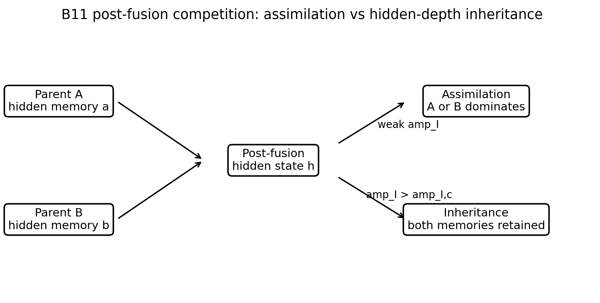
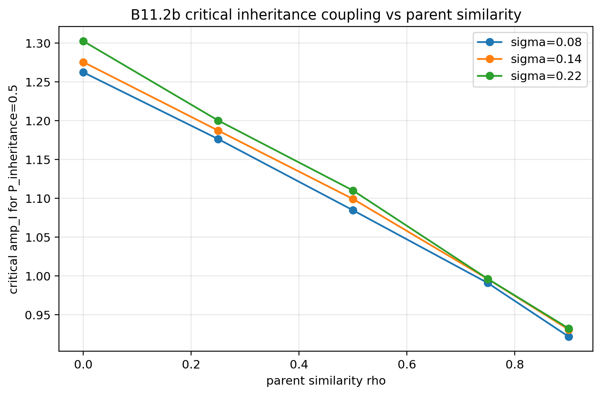
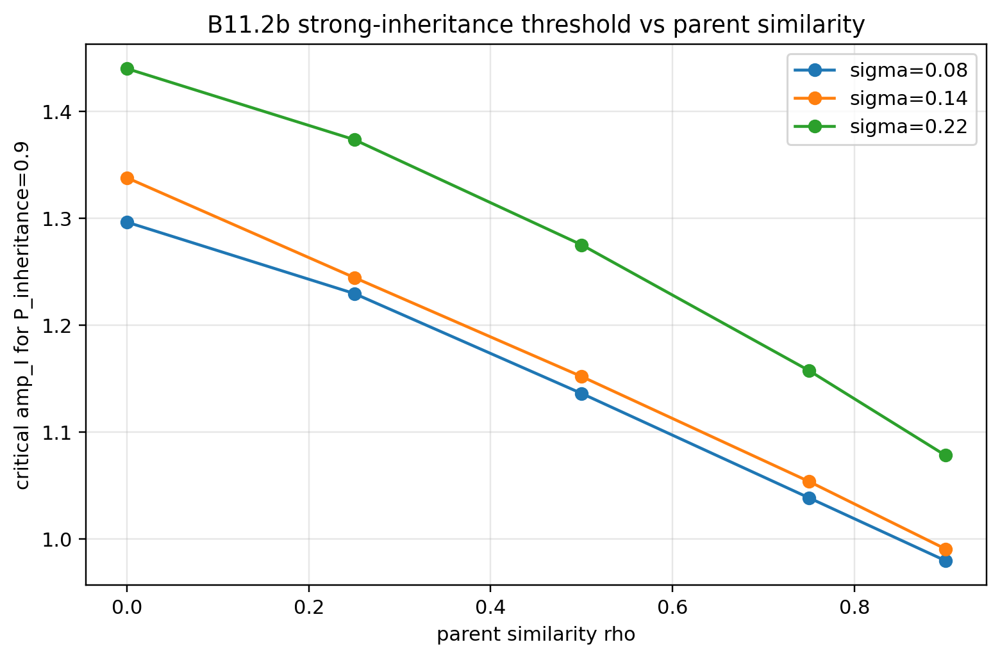
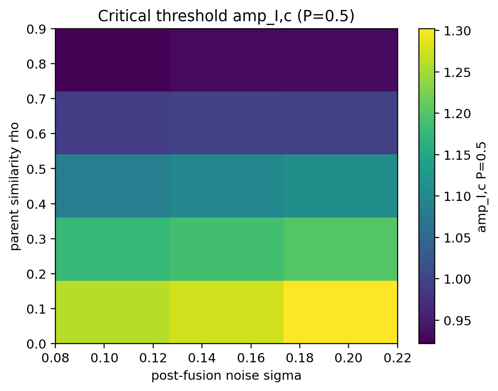
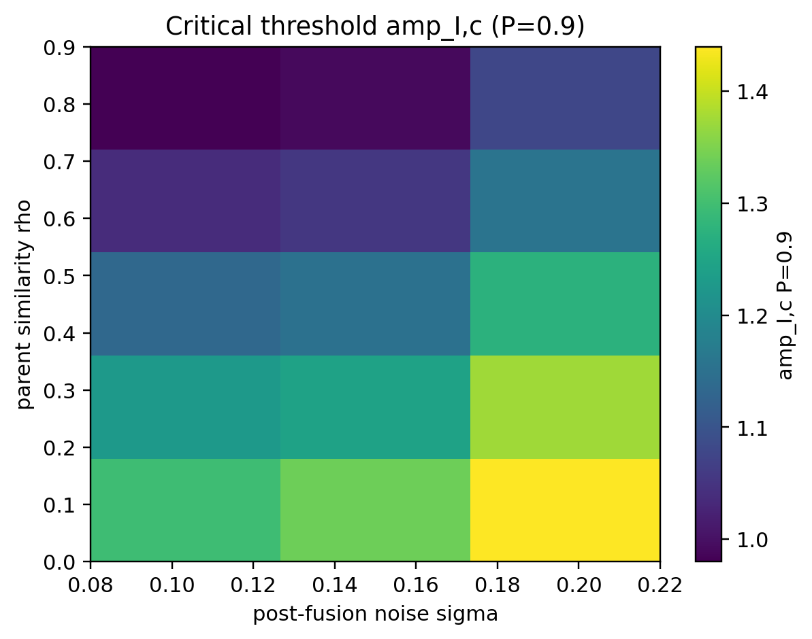
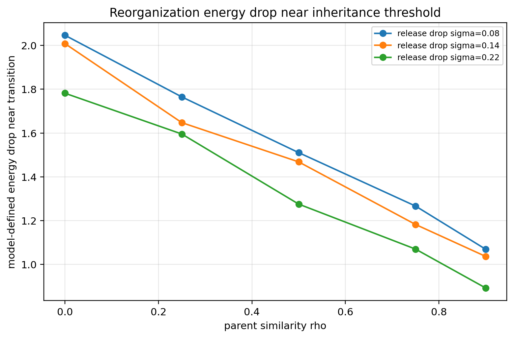
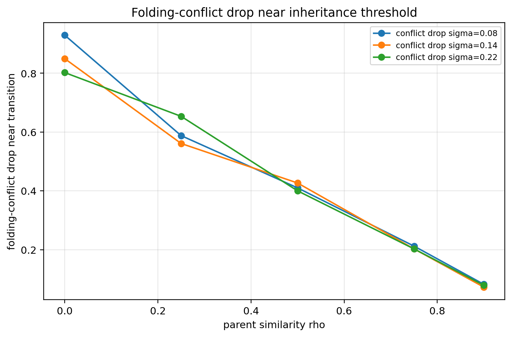

# BIG-B11 Figures

This directory contains representative figures for **BIG-B11**, the reduced stochastic hidden-depth model for post-capture inheritance versus assimilation.

The figures are intended for visual orientation and documentation. They should be read together with the BIG-B11 paper notes, Zenodo records, and the limitation statements in the main repository.

BIG-B11 is **not** a quantitative theory of biological inheritance, nuclear fusion, reproduction, or real energy release. The terms “parent,” “inheritance,” and “fusion” are used structurally within a reduced hidden-state model.

---

## Core B11 idea

B11 asks what happens after capture:

```text
post-capture state
    -> parent assimilation
    OR
    -> hidden-depth inheritance
```

The hidden-depth state is written schematically as

$$
h=(h_A,h_B),
$$

where the two sectors represent parent-like memory components in a reduced model.

---

## Representative figures

### Figure 1: Hidden-depth model schematic



**Figure:** Conceptual structure of the B11 hidden-depth model. A post-capture hidden-depth state may fall into parent assimilation or into non-assimilative inheritance if hidden-depth coupling is strong enough.

---

### Figure 2: Critical inheritance threshold at P = 0.5



**Figure:** Critical inheritance coupling for reaching approximately 50% inheritance probability. Parent similarity lowers the coupling needed for non-assimilative inheritance.

---

### Figure 3: Critical inheritance threshold at P = 0.9



**Figure:** Critical inheritance coupling for robust inheritance probability. Stronger post-fusion noise raises the threshold for stable inheritance, especially under stricter probability criteria.

---

### Figure 4: Threshold heatmap at P = 0.5



**Figure:** Heatmap of the estimated inheritance threshold for the 50% inheritance criterion across parent similarity and noise settings.

---

### Figure 5: Threshold heatmap at P = 0.9



**Figure:** Heatmap of the estimated inheritance threshold for the 90% inheritance criterion. The stricter inheritance requirement makes the stabilizing coupling threshold more demanding.

---

### Figure 6: Reorganization energy drop near threshold



**Figure:** Model-defined reorganization energy drop near the inheritance transition. Lower parent similarity tends to require larger reorganization.

---

### Figure 7: Folding-conflict drop near threshold



**Figure:** Folding-conflict drop near the transition. Conflict resolution is largest when parent memories are least similar.

---

## Structural interpretation

The main B11 mechanism can be summarized as:

```text
weak inheritance coupling
    -> A-assimilation or B-assimilation dominates

stronger inheritance coupling
    -> two-parent hidden-depth inheritance becomes stable

higher post-fusion noise
    -> robust inheritance requires stronger stabilization
```

B11 formalizes the BIG idea that fusion-like capture need not imply homogeneous assimilation.

---

## Important caution

The figures in this directory should not be presented as biological inheritance or physical fusion plots.

In particular:

- hidden-depth variables are abstract memory modes, not measured physical variables;
- parent-like sectors are not genes;
- inheritance coupling is a model parameter, not a biological mechanism;
- model-defined energy decreases are not real thermodynamic or nuclear energy release;
- the result is a reduced stochastic phase-competition model.

---

## Recommended wording

Preferred wording:

```text
hidden-depth inheritance in a reduced model
```

```text
non-assimilative post-capture stabilization
```

```text
assimilation versus inheritance phase competition
```

Avoid unqualified wording such as:

```text
B11 explains biological inheritance
```

```text
B11 predicts reproduction
```

```text
B11 proves real energy release
```

---

## Relation to Zenodo

Primary BIG-B11 record:

```text
https://doi.org/10.5281/zenodo.20828439
```

Full-resolution figures, CSV summaries, parameter files, source notes, and reproducibility packages should remain archived on Zenodo. GitHub figures are for quick browsing and documentation.

---

## File list

Expected files in this directory:

```text
figures/B11/
├── README.md
├── figure_01_hidden_depth_model_schematic.png
├── figure_02_critical_inheritance_threshold_P05.png
├── figure_03_critical_inheritance_threshold_P09.png
├── figure_04_threshold_heatmap_P05.png
├── figure_05_threshold_heatmap_P09.png
├── figure_06_reorganization_energy_drop_threshold.png
└── figure_07_folding_conflict_drop_threshold.png
```
