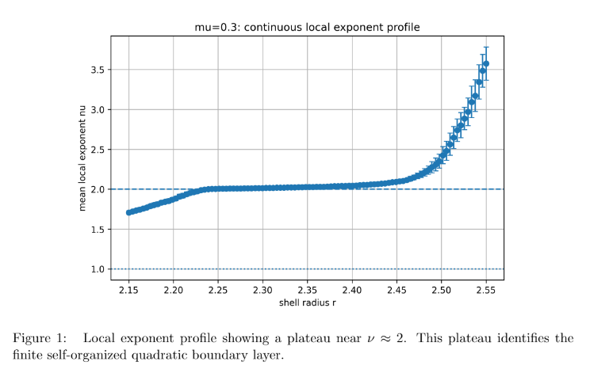

# BIG-B3.1 Figure Set

Boundary-Layer Scaling and Quadratic Landing

## Figure 1: Quadratic Layer Discovery

Local exponent profile showing the emergence of a finite quadratic boundary layer with ν ≈ 2.
