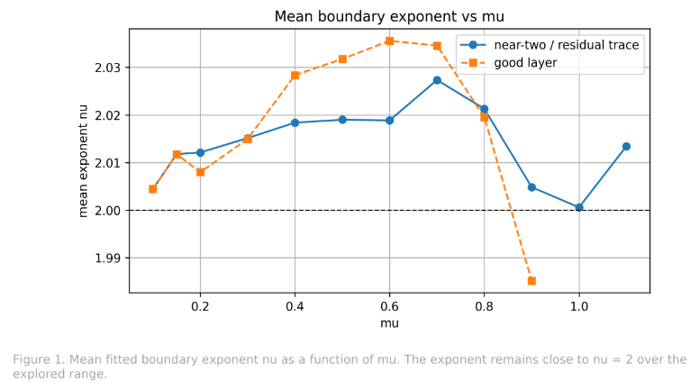
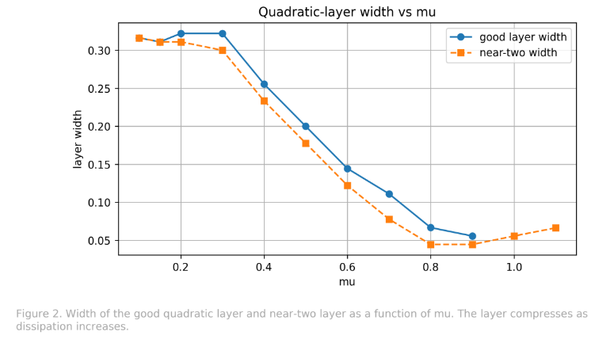
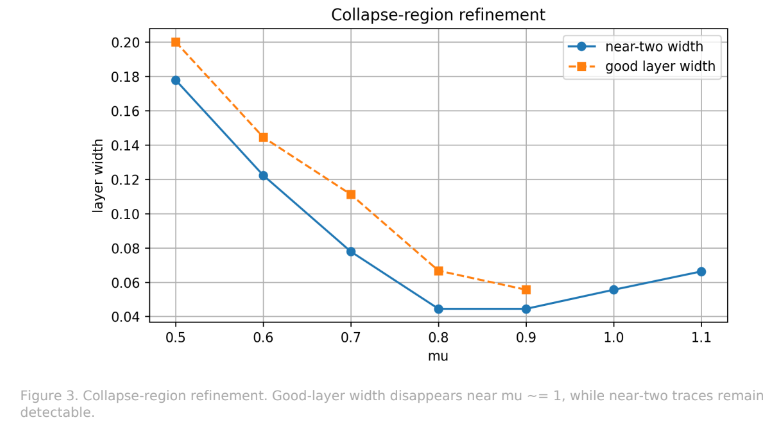
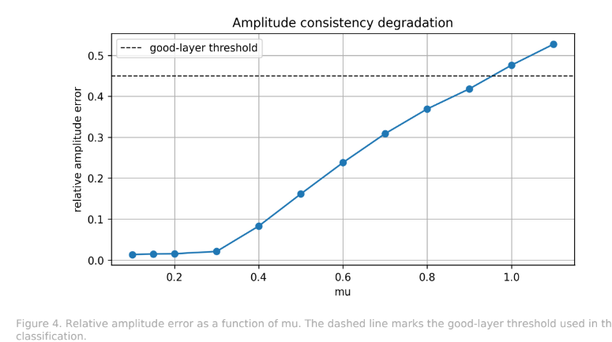

# BIG-B4.1 Figure Set

Quadratic Boundary Universality Scan

---

## Figure 1: Universality Scan

Mean fitted boundary exponent ν as a function of μ.

---

## Figure 2: Boundary-Layer Width

Compression of coherent quadratic layers with increasing dissipation.

---

## Figure 3: Collapse Region

Refined scan near the collapse threshold.

---

## Figure 4: Amplitude Consistency

Relative amplitude error and degradation of coherent quadratic layers.
