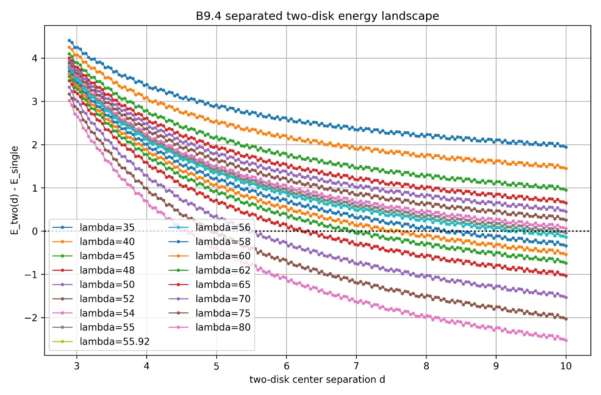
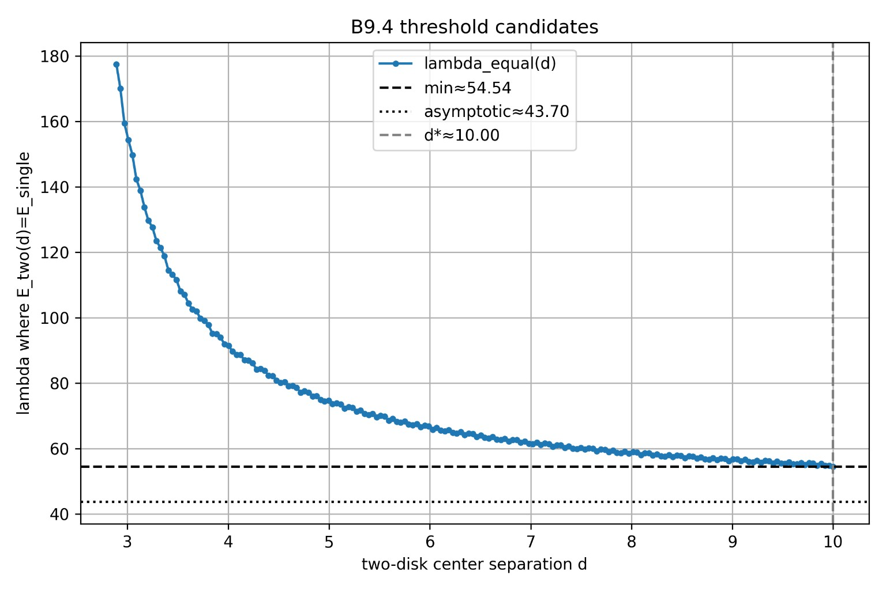
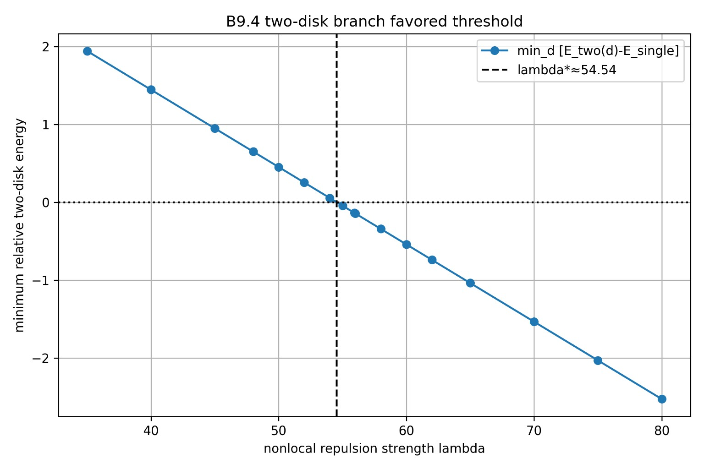
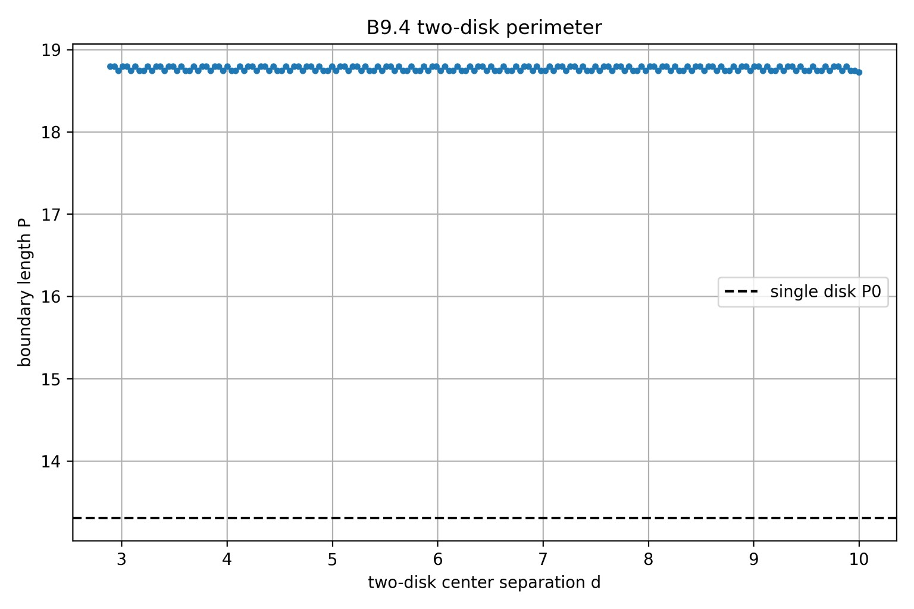
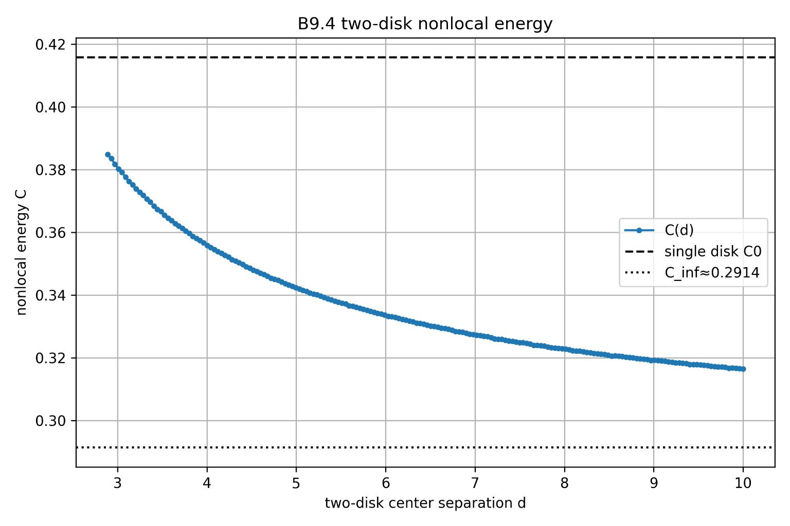
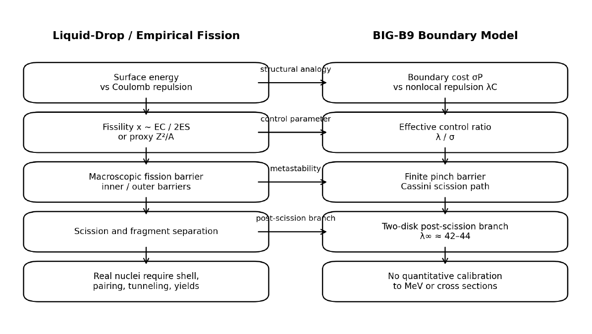
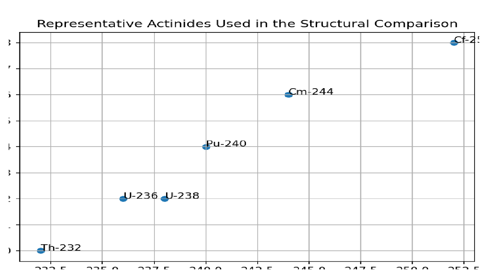
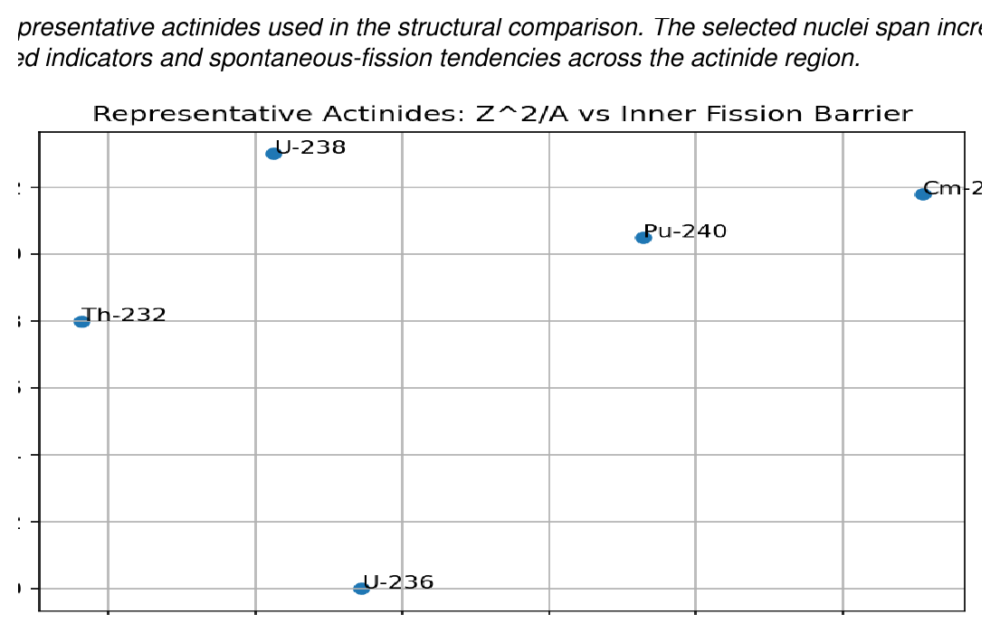

# BIG-B9 Figures

This directory contains representative figures for **BIG-B9**, the reduced boundary-energy model for fission-like metastability.

The figures are intended for visual orientation, documentation, and structural comparison. They should be read together with the BIG-B9 paper notes, Zenodo records, and the limitation statements in the main repository.

BIG-B9 is **not** a quantitative nuclear-fission model. The empirical comparison figures should be interpreted as macroscopic and structural comparisons, not as calibrated predictions of nuclear fission barriers or fragment observables.

---

## Core B9 model

BIG-B9 studies the reduced energy

$$
E(\Omega;\lambda)=\sigma P(\Omega)+\lambda C(\Omega),
$$

where:

* (P(\Omega)) is a boundary-cost or perimeter-like term,
* (C(\Omega)) is a Coulomb-like nonlocal repulsion term,
* (\sigma) controls boundary cost,
* (\lambda) controls nonlocal repulsion strength.

The central visual structure is:

```text
compact state
    -> deformation / finite pinch barrier
    -> separated branch
```

This is why the model is described as **fission-like**. The term refers to structural metastability in a reduced boundary-energy landscape, not to a calibrated nuclear calculation.

---

## Representative figures

### Figure 1: Reduced B9 energy landscape



**Figure:** Reduced B9 energy landscape generated by the competition between boundary cost and nonlocal repulsion. The compact branch is stabilized by boundary cost, while increasing nonlocal repulsion favors deformation and eventual separation.

---

### Figure 2: Lambda threshold scan



**Figure:** Threshold scan for the reduced B9 model. The scan identifies the parameter range where the separated or fission-like branch becomes energetically favored relative to the compact reference state.

---

### Figure 3: Minimum relative energy versus lambda



**Figure:** Minimum relative energy as a function of the control parameter (\lambda). This figure summarizes how the energetically favored configuration changes as nonlocal repulsion increases relative to boundary cost.

---

### Figure 4: Perimeter versus separation distance



**Figure:** Perimeter-like boundary cost along the separation or two-branch scan. The figure illustrates how the boundary-cost contribution changes as the configuration deforms toward separated states.

---

### Figure 5: Nonlocal energy versus separation distance



**Figure:** Coulomb-like nonlocal repulsion term along the separation or two-branch scan. The figure illustrates how nonlocal repulsion changes with separation geometry.

---

### Figure 6: Empirical structural correspondence



**Figure:** Structural correspondence between macroscopic liquid-drop fission intuition and BIG-B9. Surface energy corresponds to boundary cost, Coulomb repulsion corresponds to nonlocal repulsion, and the fission barrier corresponds to a finite pinch barrier. The comparison is structural, not quantitative.

---

### Figure 7: Representative actinides



**Figure:** Representative actinides used for qualitative structural comparison. The selected nuclei span increasing fissility-related indicators and spontaneous-fission tendencies across the actinide region.

Representative nuclei include:

```text
Th-232
U-236
U-238
Pu-240
Cm-244
Cf-252
```

---

### Figure 8: Barrier comparison



**Figure:** Representative (Z^2/A) values and benchmark fission-barrier indicators used for qualitative structural comparison. Barrier values should be interpreted as representative macroscopic indicators, not unique isotope constants or calibrated BIG-B9 predictions.

---

## Structural interpretation

The B9 comparison can be summarized as follows.

| Macroscopic fission intuition | BIG-B9 reduced model                   |
| ----------------------------- | -------------------------------------- |
| surface energy                | boundary cost (\sigma P(\Omega))       |
| Coulomb repulsion             | nonlocal repulsion (\lambda C(\Omega)) |
| fissility                     | ratio-like control (\lambda/\sigma)    |
| fission barrier               | finite pinch barrier                   |
| separated fragments           | two-disk or separated branch           |

No quantitative mapping between (\lambda) and MeV is assumed.

The fissility-related proxy

$$
x_{\mathrm{proxy}}=\frac{Z^2}{50A}
$$

is used only as a coarse structural indicator. It is not a calibrated liquid-drop fissility parameter.

---

## Important caution

The figures in this directory should not be presented as calibrated nuclear-fission plots.

In particular:

* (\lambda) is not calibrated to MeV;
* (x_{\mathrm{proxy}}) is only a coarse fissility-related proxy;
* benchmark barrier values are representative macroscopic indicators;
* empirical fission barriers are model-dependent and often double-humped;
* no quantitative fit from BIG-B9 to empirical fission barriers is claimed;
* shell corrections, pairing effects, quantum tunneling, excitation-energy dependence, fragment yields, and cross-section normalization are not explicitly resolved in the present minimal B9 model.

This does not mean that such effects are fundamentally incompatible with the BIG framework. In future extensions, they may be represented through effective boundary corrections, state-dependent coefficients, hidden-depth mode contributions, barrier-crossing dynamics, or other higher-level structures built upon the B9 energy landscape.

---

## Recommended wording

Preferred wording:

```text
macroscopic structural comparison
```

```text
fission-like metastability in a reduced boundary-energy model
```

```text
boundary cost versus nonlocal repulsion
```

```text
qualitative structural correspondence with liquid-drop fission intuition
```

Avoid unqualified wording such as:

```text
B9 predicts nuclear fission barriers
```

```text
B9 quantitatively fits actinide fission data
```

```text
B9 is a nuclear fission model
```

---

## Relation to Zenodo

GitHub figures are for orientation and documentation.

Full-resolution figures, raw datasets, numerical outputs, and reproducibility packages should remain archived on Zenodo.

Primary BIG-B9 record:

```text
https://doi.org/10.5281/zenodo.20799131
```

Additional B9 empirical structural-comparison records may be listed here when finalized.

---

## File list

Expected files in this directory:

```text
figures/B9/
├── README.md
├── figure_01_energy_landscape.png
├── figure_02_lambda_threshold_scan.png
├── figure_03_min_relative_energy_vs_lambda.png
├── figure_04_perimeter_vs_d.png
├── figure_05_nonlocal_energy_vs_d.png
├── figure_06_empirical_structural_correspondence.png
├── figure_07_representative_actinides.png
└── figure_08_barrier_comparison.png
```
