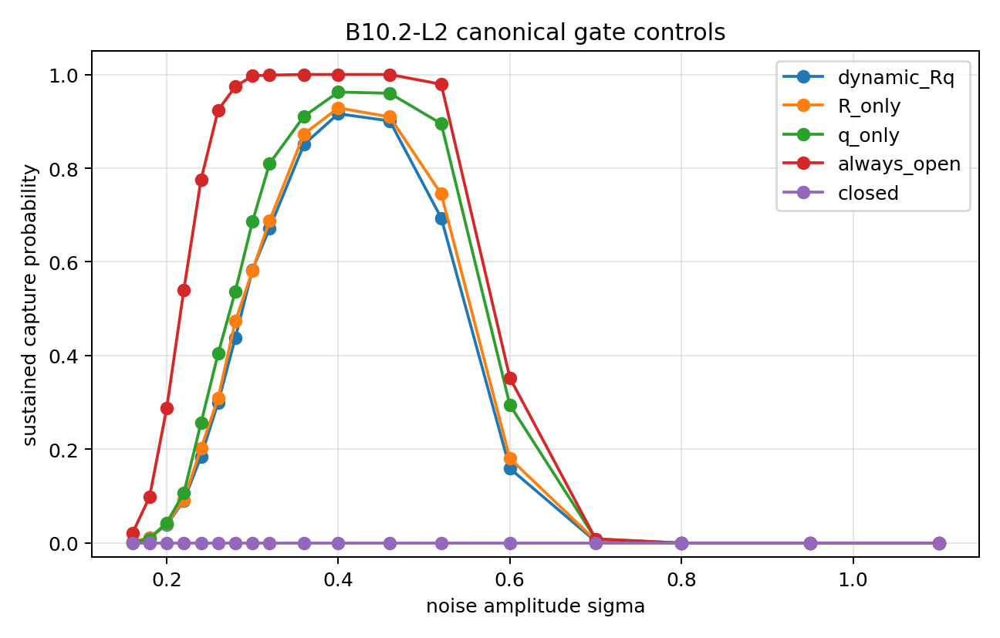
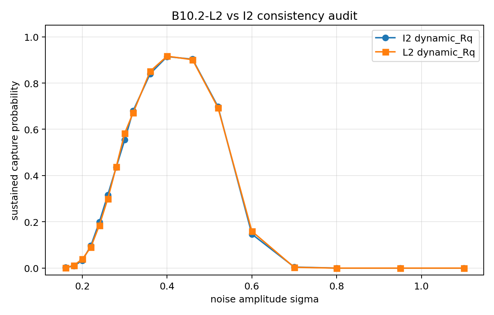
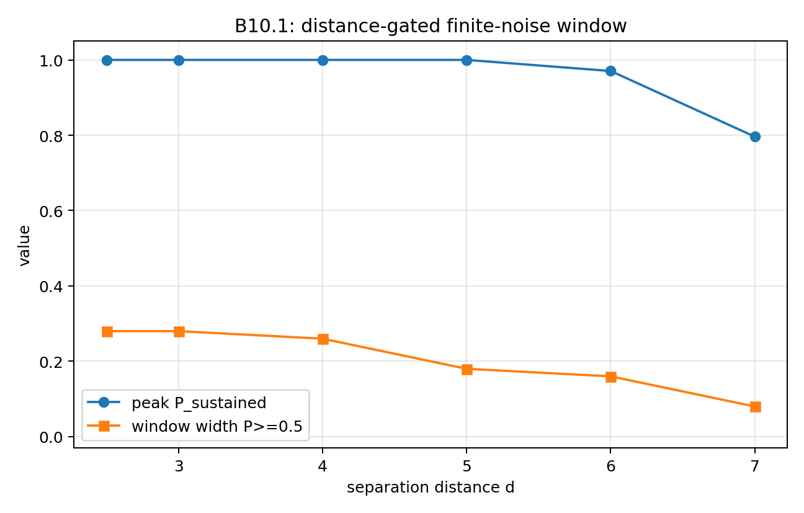

# BIG-B10: Finite-Noise Capture and Stochastic-Resonance-Like Boundary Locking

**BIG-B10** studies finite-noise sustained capture in a reduced dynamic boundary model.

This folder is the main explanatory entry point for BIG-B10.

Representative figures are stored in:

```text
../../figures/B10/
```

---

## Core idea

BIG-B10 asks:

> Can boundary-supported systems achieve sustained capture only within a finite-noise window?

This question follows naturally from BIG-B9.

If B9 studies separation and fission-like branching, B10 studies the reverse direction:

```text
separated boundary-supported systems
    -> approach
    -> internal activation
    -> sustained capture
```

The central result is that noise can be both constructive and destructive.

```text
low noise
    -> capture channel rarely activates

intermediate noise
    -> sustained capture becomes likely

high noise
    -> first contact may occur, but sustained capture is disrupted
```

This is why the behavior is described as **stochastic-resonance-like**.

---

## First hit is not sustained capture

A central B10 distinction is:

```text
first hit != sustained capture
```

A trajectory may reach contact or near-contact once without entering a persistent coupled state.

B10 therefore distinguishes:

* **first hit**: the system reaches a proximity or contact criterion;
* **sustained capture**: the system remains locked for a required duration or satisfies a hold condition;
* **escape**: the system fails to remain captured;
* **timeout**: the trajectory does not complete the required event within the observation time.

This distinction is essential because high-noise trajectories may still show frequent first hits while failing to maintain sustained capture.

---

## Representative figure


**Figure:** B10 separates first hit from sustained capture. Sustained capture peaks around an intermediate noise level, while at high noise first-hit probability can remain high even as sustained capture collapses.

More figures are available here:

[../../figures/B10](../../figures/B10)

---

## Main result

The main B10 result is a finite-noise sustained-capture window.

A representative model-level summary is:

```text
control mode: dynamic_Rq
peak sigma: approximately 0.40
peak sustained-capture probability: approximately 0.91--0.92
high-noise sustained capture: collapses toward zero
```

These values are not universal constants.

They are numerical results within the specified reduced model, parameter scan, and event definitions.

The important point is not the exact numerical value of the peak, but the existence of a finite-noise window:

```text
too little noise
    -> insufficient activation

intermediate noise
    -> sustained capture

too much noise
    -> disruption of sustained capture
```

---

## Additional representative figures

### Canonical gate controls



**Figure:** Canonical gate-control results. Closed-channel control suppresses sustained capture, while dynamic and open-channel controls retain finite-noise windows.

---

### L2 versus I2 consistency audit



**Figure:** Consistency audit comparing the canonical dynamic_Rq implementation with the I2 dynamic_Rq result.

---

### Distance gating window



**Figure:** Distance-gating result. As initial distance increases, the finite-noise capture window contracts and the peak sustained-capture probability declines.

---

## Interpretation

B10 suggests that boundary capture is not simply a matter of distance.

A successful capture event requires at least three components:

1. **Approach**
   The systems must come close enough.

2. **Channel activation**
   Internal degrees of freedom must open the capture channel.

3. **Sustained locking**
   The coupled state must persist long enough to count as capture.

This gives B10 its role within BIG:

```text
boundary approach
    -> internal activation
    -> sustained capture
```

In this reduced model, capture is therefore not treated as a single instantaneous event.
It is treated as a dynamical process with an activation channel and a persistence condition.

---

## Relation to stochastic resonance

B10 is described as stochastic-resonance-like because noise has a non-monotonic effect.

Noise is not merely destructive.

At low noise, the system may fail to activate the capture channel.
At intermediate noise, activation and sustained locking become more likely.
At high noise, trajectories may still reach first contact, but sustained capture becomes unstable.

The resulting pattern is:

```text
low noise       -> low sustained capture
intermediate    -> high sustained capture
high noise      -> low sustained capture
```

This is a structural analogy to stochastic resonance, not a claim that the model reproduces a specific physical stochastic-resonance system.

---

## Important limitations

BIG-B10 is **not** a quantitative theory of nuclear fusion.

It does not model:

* Coulomb-barrier penetration,
* quantum tunneling,
* nuclear potentials,
* plasma kinetics,
* reaction cross sections,
* thermodynamic fusion yield,
* or real fusion energy release.

The term “fusion-like” refers only to the structural sequence of approach, activation, capture, and sustained locking in a reduced boundary model.

B10 should therefore be read as a reduced dynamical study of boundary capture, not as a physical theory of nuclear fusion.

---

## Relation to the BIG programme

Within BIG, B10 plays the role of the **capture / fusion-like branch**.

It connects naturally to:

```text
B9  -> separation / fission-like metastability
B10 -> finite-noise capture / fusion-like locking
B11 -> post-capture inheritance versus assimilation
B12 -> unified boundary dynamics
```

B10 moves the programme from separation to capture.

B9 asks how a compact state can become metastable relative to separation.
B10 asks how separated boundary-supported systems can re-enter sustained coupling.
B11 then asks what kind of state survives after capture.

---

## Recommended wording

Preferred:

> BIG-B10 studies stochastic-resonance-like finite-noise capture in a reduced boundary-dynamical model.

Preferred:

> B10 distinguishes first contact from sustained capture.

Preferred:

> Sustained capture appears within a finite-noise window.

Avoid unless carefully qualified:

> BIG-B10 explains nuclear fusion.

> BIG-B10 predicts fusion rates.

> First hit means fusion.

> B10 models real fusion energy release.

---

## Zenodo record

Primary BIG-B10 record:

https://doi.org/10.5281/zenodo.20819427
