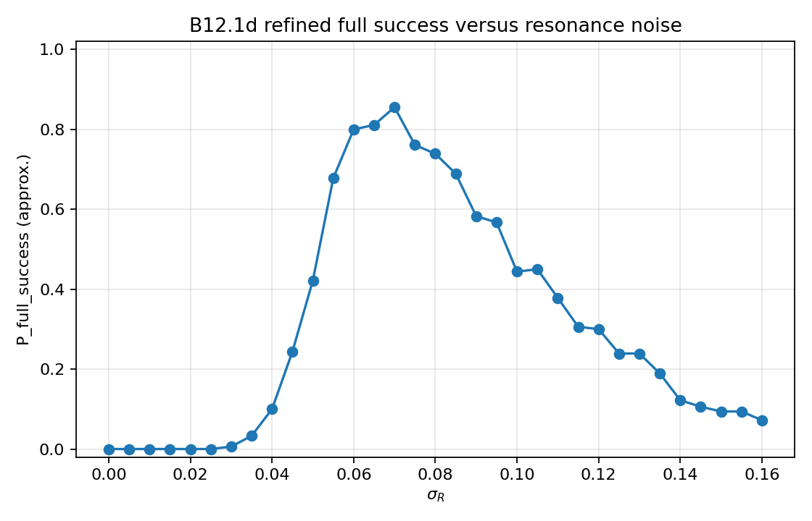
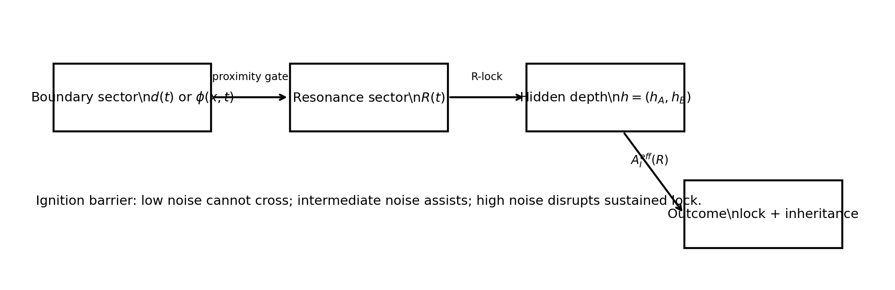
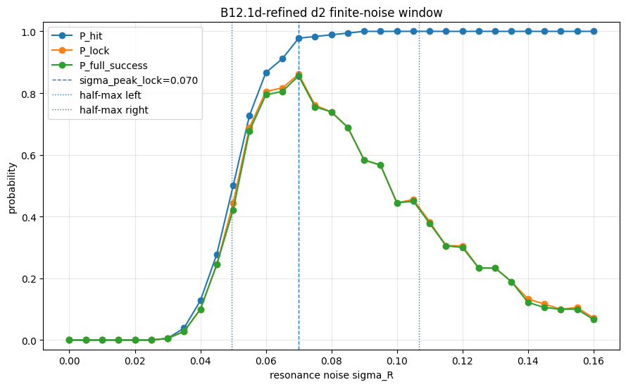
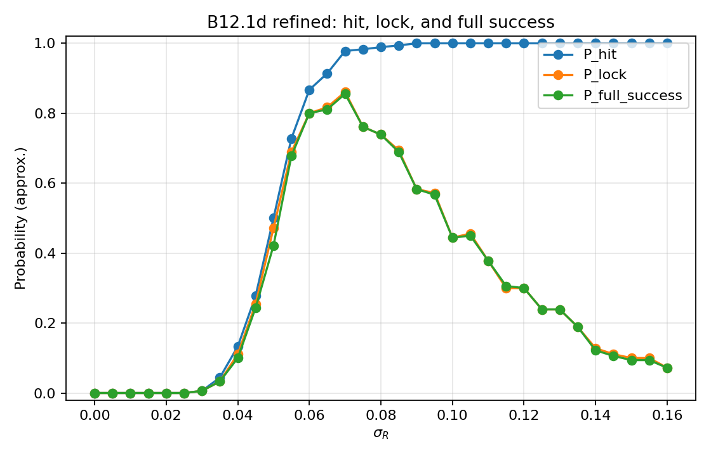
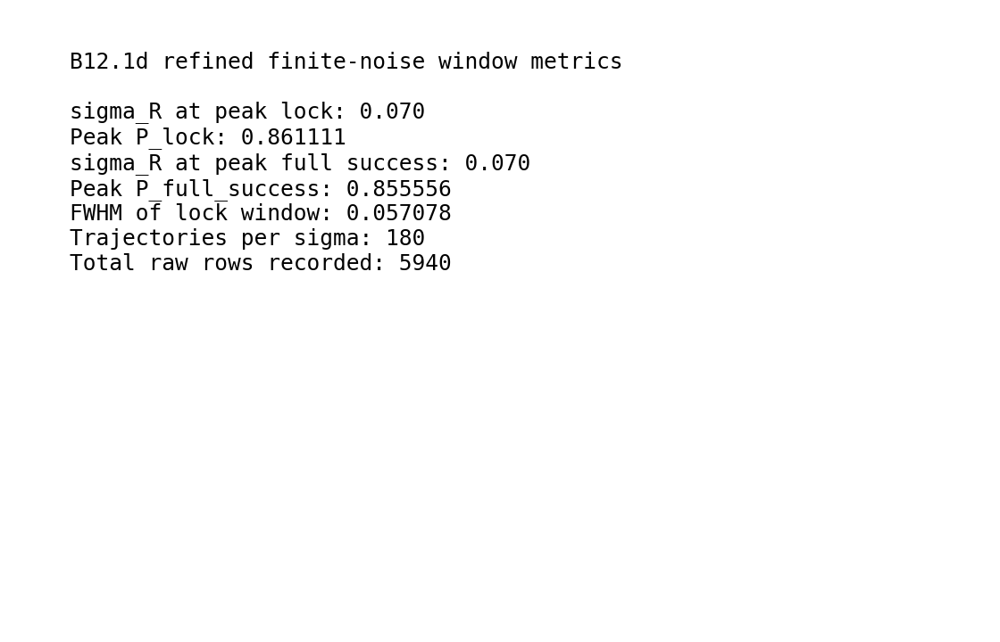

# BIG-B12: Unified Boundary Dynamics with Finite-Noise R-Lock and Hidden-Depth Inheritance

**BIG-B12** connects the main motifs of BIG-B9, BIG-B10, and BIG-B11 in one reduced boundary-dynamical framework.

This folder is the main explanatory entry point for BIG-B12.

Representative figures are stored in:

```text
../../figures/B12/
```

---

## Core role in BIG

B12 integrates three earlier BIG directions:

```text
B9  -> separation / fission-like metastability
B10 -> finite-noise capture / fusion-like locking
B11 -> post-capture hidden-depth inheritance
```

The resulting B12 sequence is:

```text
boundary approach
    -> noise-assisted R-lock
    -> hidden-depth inheritance
```

This is a reduced mathematical and numerical model.

It is not a completed physical unification theory.

---

## Reduced variables

A minimal B12-type model contains three coupled sectors:

```text
d(t): boundary distance / proximity
R(t): internal resonance vector or resonance sector
h(t): hidden-depth inheritance state
```

Their roles are:

* (d(t)): describes whether boundary-supported systems approach, escape, or remain near each other;
* (R(t)): describes whether an internal resonance channel ignites and remains locked;
* (h(t)): describes whether the post-lock hidden-depth state collapses into assimilation or preserves inheritance.

The model therefore connects geometry, resonance, and hidden-depth memory in a single reduced event chain.

---

## Representative figure



**Figure:** Approximate full-success probability across resonance-noise values in the B12.1d refined scan. Full success is stricter than final-state similarity because it requires strict R-lock together with hidden-depth inheritance.

More figures are available here:

[../../figures/B12](../../figures/B12)

---

## Core event sequence

The intended B12 event chain is:

```text
approach
    -> hit or near-contact
    -> R-ignition
    -> sustained R-lock
    -> hidden-depth inheritance
```

A strict successful event must satisfy both:

```text
strict R-lock
AND
hidden-depth inheritance
```

A useful shorthand is:

```text
full success = strict R-lock AND hidden-depth inheritance
```

This distinction is important.

A trajectory may show contact, partial resonance, or late inheritance-like behavior without satisfying the stricter full-success condition.

---

## Ignition barrier and finite-noise R-lock window

A key B12 refinement is the introduction of an ignition barrier in the R-sector.

With an ignition barrier, B12 restores a finite-noise R-lock window:

```text
low resonance noise
    -> R-sector fails to ignite
    -> no strict R-lock

intermediate resonance noise
    -> R-sector ignites and remains coherent
    -> R-lock and full success become likely

high resonance noise
    -> R-sector becomes decohered or unstable
    -> strict lock and full success decline
```

This is a stochastic-resonance-like structure, but it remains a reduced-model result.

The point is not that noise is always beneficial.

The point is that a finite intermediate noise range may allow activation without destroying sustained coherence.

---

## Representative refined scan

In the B12.1d refined d2 scan, the finite-noise R-lock window was explored with a dense scan over (\sigma_R).

A representative summary is:

```text
sigma_R at peak lock:      approximately 0.070
P_lock at peak:            approximately 0.861
P_full_success at peak:    approximately 0.856
raw rows:                  5940
```

These values should be read as numerical results for the specified reduced model, parameter choice, event definitions, and scan configuration.

They are not universal constants.

---

## Additional representative figures

### Unified boundary architecture



**Figure:** Conceptual architecture of the reduced BIG-B12 system. The model connects boundary distance, resonance-sector locking, and hidden-depth inheritance.

---

### Finite-noise R-lock window



**Figure:** B12.1d refined finite-noise window. Low noise fails to ignite the resonance sector; intermediate noise produces sustained R-lock and full success; higher noise disrupts sustained locking.

---

### Full success versus noise


**Figure:** Full-success probability across resonance-noise values. Full success requires both strict R-lock and hidden-depth inheritance.

---

### Hit, lock, and full-success comparison



**Figure:** Comparison of approximate hit, lock, and full-success probabilities across resonance-noise values. This figure emphasizes that contact-like events, R-lock, and full success are distinct event classes.

---

### Refined window metrics summary



**Figure:** Summary of reported B12.1d refined finite-noise window metrics.

---

## Interpretation

B12 suggests that a boundary-mediated transformation may require three conditions:

1. **Approach**
   The boundary-supported systems must enter a near-contact or interaction region.

2. **Resonance locking**
   Internal degrees of freedom must ignite and remain locked for a required duration.

3. **Hidden-depth inheritance**
   The post-lock state must preserve non-assimilative hidden-depth structure rather than collapse into a single parent-like attractor.

B12 is therefore not merely a “fusion-like” model.

It is a reduced model of boundary transformation with non-assimilative post-capture memory.

---

## Relation to B9, B10, and B11

B12 unifies the B9--B11 sequence.

```text
B9:
    Boundary cost versus nonlocal repulsion
    -> separation / fission-like metastability

B10:
    Boundary approach plus finite noise
    -> sustained capture / fusion-like locking

B11:
    Post-capture hidden-depth state
    -> inheritance versus assimilation

B12:
    Boundary approach + R-lock + hidden-depth inheritance
    -> unified reduced boundary dynamics
```

This makes B12 the current integration point of the BIG boundary-dynamics branch.

---

## Why full success is stricter than final similarity

In some reduced models, a final state may appear close to an inherited or stable state even if the trajectory did not pass through a sustained resonance-locking phase.

B12 separates these ideas.

```text
final similarity:
    the end state resembles a target or inherited state

strict R-lock:
    the resonance sector remains locked according to a defined criterion

hidden-depth inheritance:
    the hidden-depth state preserves non-assimilative inherited structure

full success:
    strict R-lock AND hidden-depth inheritance
```

This prevents the model from overcounting trajectories that look successful only at the endpoint.

---

## Important limitations

BIG-B12 is **not** a completed physical unification theory.

It is also not a quantitative theory of:

* nuclear fission,
* nuclear fusion,
* biological inheritance,
* real thermodynamic energy release,
* material-interface fusion,
* cosmology,
* consciousness,
* or AI identity.

The terms “approach,” “fusion-like,” “R-lock,” and “inheritance” are used structurally within a reduced mathematical model.

In particular:

* (d(t)) is a reduced boundary-distance variable, not a full physical coordinate system;
* (R(t)) is a reduced resonance sector, not a calibrated nuclear, material, biological, or cognitive mode;
* (h(t)) is a hidden-depth state, not biological genetics;
* full success is a model-defined event criterion;
* energy-like drops are model-level quantities, not real energy release.

B12 should therefore be read as a reduced boundary-dynamical experiment.

---

## Relation to the BIG programme

Within BIG, B12 plays the role of the **unified boundary-dynamics branch**.

It connects:

```text
separation
    -> capture
    -> resonance locking
    -> hidden-depth inheritance
```

More specifically:

```text
B9:  separation / fission-like metastability
B10: finite-noise capture / fusion-like locking
B11: post-capture inheritance versus assimilation
B12: unified boundary approach, R-lock, and hidden-depth inheritance
```

B12 is the point where the B9--B11 sequence becomes one reduced event chain.

---

## Recommended wording

Preferred:

> BIG-B12 integrates boundary approach, finite-noise R-lock, and hidden-depth inheritance in a reduced boundary-dynamical model.

Preferred:

> B12 provides model-level evidence for a finite-noise R-lock window when an ignition barrier is included.

Preferred:

> Full success in B12 requires both strict R-lock and hidden-depth inheritance.

Preferred:

> B12 is a reduced integration of the B9--B11 boundary-dynamics sequence.

Avoid unless carefully qualified:

> BIG-B12 explains nuclear fusion.

> BIG-B12 proves biological inheritance.

> BIG-B12 is a physical unification theory.

> B12 predicts real energy release.

> B12 is a theory of consciousness or AI identity.

---

## Zenodo record

Primary BIG-B12 record:

```text
DOI to be added
```

Related records:

```text
BIG-B9:  https://doi.org/10.5281/zenodo.20799131
BIG-B10: https://doi.org/10.5281/zenodo.20819427
BIG-B11: https://doi.org/10.5281/zenodo.20828439
```
