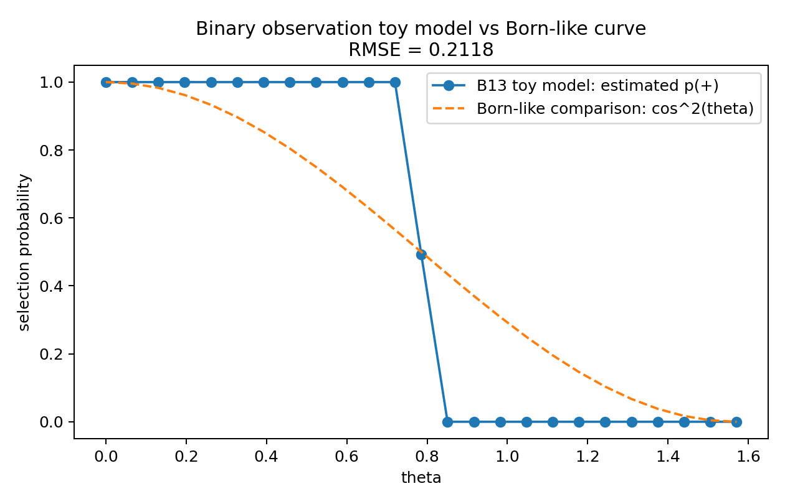

# BIG-B13 — Boundary Folding as a Reduced Model of Observation and Self-Measurement

## Purpose

BIG-B13 introduces a reduced observer--system interaction in which boundary overlap couples hidden-depth states and changes state selection.

A compact state notation is

```text
system:   S = (phi, R, h)
observer: O = (Phi, Q, H)
```

with an observation-like coupling of the form

$$
E_{\mathrm{obs}}(S,O)
=
-\lambda_{\mathrm{obs}}\,F_{\mathrm{bdry}}(\phi,\Phi)\,h^T A H.
$$

The numerical experiments examine basin selection, observer directionality, finite noise, and self-observation.

## Representative figures



*Baseline binary-selection diagnostic compared with the Born-like reference used in B13. The comparison is empirical and does not constitute a derivation of the Born rule.*


*Finite-noise robustness diagnostic for the reduced selection model.*

## Scope

The Born-like curves used in B13 are reference comparisons. B13 does **not** derive quantum measurement, the Born rule, the uncertainty principle, consciousness, or AI perception.

## Publication

DOI: https://doi.org/10.5281/zenodo.21072783

Author: Jun Lucis
