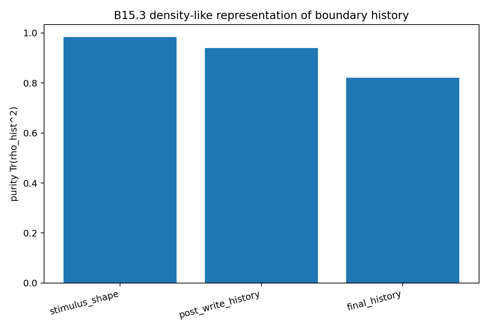

# BIG-B15 — Observation Traces and Boundary History

## Purpose

BIG-B15 provides a reduced operator representation connecting B13/B13.1 observation traces with B14 boundary history.

Hidden-depth states can be embedded in a real two-dimensional Hilbert-like representation, while finite state clouds can be represented by density-like mixtures. Boundary-history amplitude is kept distinct from the normalized history representation.

The update maps are classified as linear, affine, nonlinear, or state-dependent.

## Representative figures

*Response curves in the density-like boundary-history representation.*

*Purity diagnostic for finite hidden-depth state clouds. The density-like representation is mathematical bookkeeping, not a claim of a physical quantum state.*

## Scope

The Hilbert-like and density-like notation is representational. B15 does not derive quantum mechanics, the Born rule, biological memory, heredity, or physical quantum channels.

## Publication

DOI: https://doi.org/10.5281/zenodo.21173333

Author: Jun Lucis
