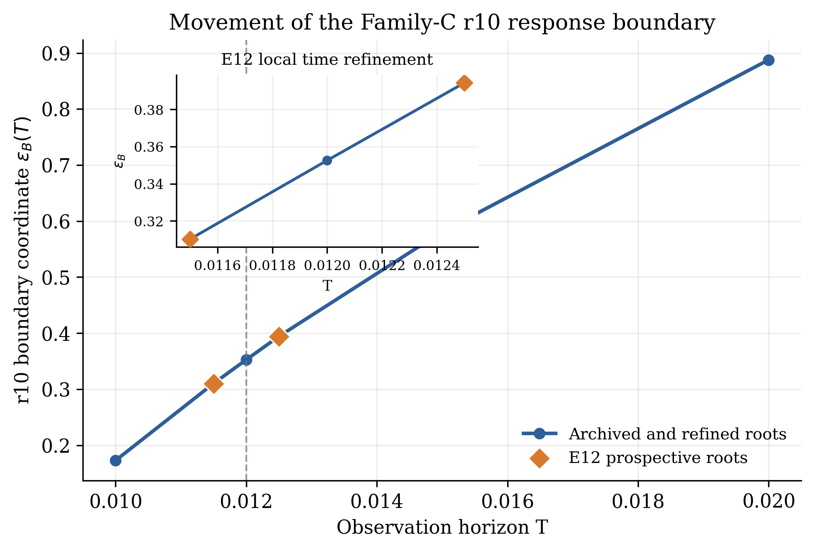
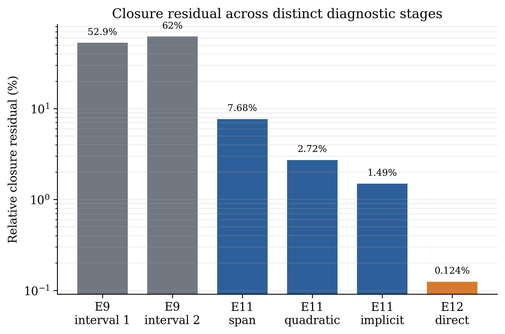
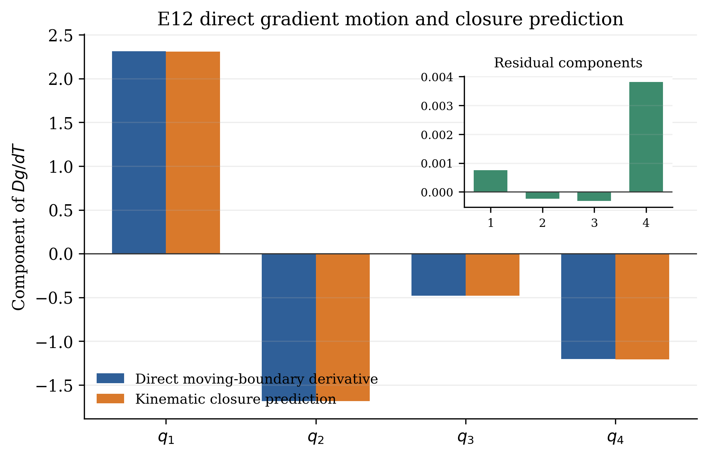

# BIG-B21 — Local Kinematic Closure of Operator-Generated Response Boundaries

*Direct Hessian Transport and Prospective Time Refinement in Synthetic Vorticity Dynamics*

> 🇯🇵 **日本語要約**  
> B21は、B20で定義した有限時間応答境界が観測時間 $T$ とともに動くとき、その局所応答勾配がどのように輸送されるかを検査します。B20.5と完全に同じ正規化4次元部分空間と、合成Family-Cの `r10` 分枝を用い、$g=\nabla_S F_T$ に対する局所運動学的恒等式 $Dg/dT=\partial_Tg+H_S\dot P_B$ を数値的に監査しました。凍結した最終E12試験では、closure residualは **0.1242154%**、予測と観測の角度は **0.0698935度**で、residualはroot bracketから得た一次の上限 **0.2174844%** を下回りました。追加の有効境界力学項を必要とする再現可能な残差は分解されませんでした。これは新しい運動方程式、連続体でのHessian存在定理、不変多様体、物理空間の境界則、普遍的separatrix、Navier--Stokes爆発・正則性の主張ではありません。B20.6の判定は引き続き **INCONCLUSIVE** です。

## Purpose

B21 asks a narrower question than B20.6:

> Once a local response-boundary branch is resolved, does the observed time transport of its response gradient close under the ordinary kinematics of a moving level set?

B20 defines

$$
F_T(P)=Z[U_T(P)]-Z[P],
\qquad
\mathcal{B}_T=\{P:F_T(P)=0\}.
$$

Within the exact normalized four-dimensional B20.5 subspace $S$, B21 writes

$$
g(T,P)=\nabla_S F_T(P)
$$

and tests, along a tracked boundary point $P_B(T)$,

```math
\frac{Dg}{dT}=\partial_T g+H_S\dot P_B.
```

where $H_S$ is the subspace Hessian of $F_T$.

## Study design

The study uses synthetic Family C on the `r10` branch with:

- $N=48$,
- $L=8$,
- $\nu=0.003$,
- $E_{\max}=30$,
- time-step cap $5\times10^{-5}$.

Experiments E1--E11 are exploratory diagnostics. E12 is the prospectively frozen terminal test. No additional PDE experiment was added after the E12 stopping rule.

## Main numerical findings

- **E10, Hessian-vector convergence:** the two-scale Hessian-vector products have norm ratio **0.9999603**, angle **0.001016 degrees**, and relative difference $4.35\times10^{-5}$.
- **E11, sensitivity localization:** the dominant uncertainty is localized to the moving-boundary speed rather than to the Hessian-vector evaluation.
- **E12, frozen prospective closure:** using $T_-=0.0115$ and $T_+=0.0125$, the direct boundary speed is **83.96484375**. The closure residual is **0.1242154%**, the prediction--observation angle is **0.0698935 degrees**, and the residual lies below the first-order root-bracket bound of **0.2174844%**.

Within the stated resolution and protocol, no reproducible residual requiring an additional effective boundary-dynamical term was resolved.

## Representative figures



**Figure 1:** Local tracking of the resolved response-boundary branch across the tested observation-time window.



**Figure 2:** Residual and uncertainty audit used to separate numerical closure error from a putative additional term.



**Figure 3:** Frozen E12 comparison of the directly observed response-gradient transport with the kinematic prediction.

## Relationship to B20

B21 starts from the resolved local `r10` branch in the exact normalized B20.5 subspace. It does **not** repair or upgrade B20.6.

B20.6 remains **INCONCLUSIVE** because its frozen finite-distance scan produced only one informative crossing. B21 instead tests a different, local question: whether response-gradient transport along a resolved branch is explained by the standard moving-level-set kinematics.

## Scope

B21 is a finite-resolution numerical study in a finite synthetic vorticity family and an exact normalized four-dimensional subspace.

It does **not** provide:

- a new equation of motion;
- a proof of continuum differentiability or Hessian existence;
- an invariant manifold;
- a physical-space boundary law;
- a universal separatrix;
- a Navier--Stokes blow-up, regularity, or singularity theorem.

No B22 claim or experiment is part of B21.

## Publication

**Zenodo record and DOI:** https://doi.org/10.5281/zenodo.22876813

The English preprint is the authoritative version. A Japanese reference translation is included in the same Zenodo record.

Author: Jun Lucis
