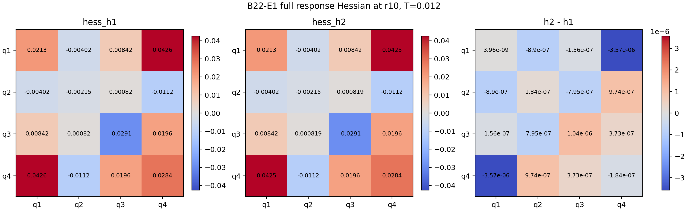
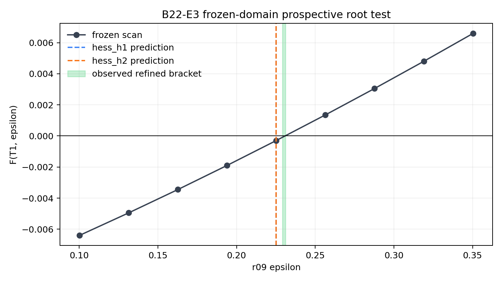

# BIG-B22 — Prospective Local Geometry of Operator-Generated Response Boundaries

*Finite-Resolution Curvature, Normal Rotation, and Sequential Held-Out Forecasts in Synthetic Vorticity Dynamics*

## 日本語要約

> **問い:** B21で局所運動学的閉包を検査した有限時間応答境界について、Hessian、曲率、法線回転、主方向を有限解像度で安定に測定し、未観測の将来時刻を前向きに予測できるか。
>
> **方法:** B20.5/B21と同じ正規化4次元Family-C部分空間を用い、`r10` の記述的なE1–E2で測定法を監査した後、事前に予約した `r09` 分枝でE3とE5の予測、許容誤差、停止規則を将来PDE計算の前に凍結しました。
>
> **結果:** 最初のheld-out段階E3では、`hess_h2` のroot誤差は **0.00488281**、法線角誤差は **0.21068度**でした。観測されたT1から次時刻を予測する第2段階E5では、root誤差 **0.00878906**、`hess_h2` 法線角誤差 **0.37444度**、Hessian相対誤差 **0.0085910**、最大主方向角誤差 **0.37895度**でした。すべての凍結gateを通過し、停止規則に到達しました。
>
> **BIGとしての前進:** B21の一次の局所運動学的閉包を、有限解像度の二次局所幾何と、2段階のheld-out予測監査へ進めました。
>
> **限界:** E5は観測されたT1を使う逐次予測であり、T0だけからの二段先予測ではありません。連続体曲率定理、普遍的境界法則、不変多様体、物理空間法線、Navier–Stokes方程式の爆発・正則性は主張しません。B20.6は引き続き **INCONCLUSIVE** です。

## Purpose

B22 asks whether finite-resolution second-order descriptors of a resolved response zero set can be measured stably and used prospectively. In the exact normalized four-dimensional Family-C subspace,

```math
F(T,P)=Z[U_T(P)]-Z[P], \qquad \mathcal B_T=\{P:F(T,P)=0\},
```

with response gradient and subspace Hessian

```math
g=\nabla_S F, \qquad H_S=\nabla_S^2F.
```

The study measures local normal rotation, the shape operator, signed principal curvatures, and principal directions. It then freezes predictions before evaluating new PDE trajectories.

## Study design

- **E1 — full local Hessian and curvature (`r10`):** reconstruct the complete $4\times4$ Hessian at two finite-difference scales and test cross-scale stability.
- **E2 — retrospective normal rotation (`r10`):** compare the Hessian-based local rotation estimate with the already observed B21 branch motion. This is calibration, not held-out evidence.
- **E3 — first prospective stage (`r09`, T0→T1):** freeze the root and normal predictions, thresholds, scan domain, and stopping rule before any T1 PDE evaluation.
- **E4 — observed-T1 geometry:** reconstruct the T1 Hessian and curvature at two scales after E3 is complete.
- **E5 — second prospective stage (`r09`, observed T1→T2):** freeze root, normal, Hessian, curvature, and principal-direction predictions before any T2 PDE evaluation.

## Main findings

1. **Stable finite-resolution local geometry at `r10`.** E1 found a normal cross-scale angle of **0.0027647°** and a Hessian relative Frobenius difference of **6.7666×10⁻⁵**. All individually resolved curvature modes passed their frozen cross-scale gates.
2. **Retrospective consistency with B21.** E2 obtained a relative error of **0.0668%** for the `hess_h2` path-direction normal-rotation rate. Because the future data were already known, this is a consistency check only.
3. **First held-out forecast passed.** In E3, the `hess_h2` root error was **0.00488281** and the normal-angle error was **0.21068°**.
4. **Observed-T1 geometry remained stable.** E4 found a Hessian cross-scale relative difference of **7.5719×10⁻⁵**.
5. **Second sequential held-out forecast passed.** In E5, the root error was **0.00878906**; the `hess_h2` normal-angle error was **0.37444°**; the Hessian relative error was **0.0085910**; and the largest resolved principal-direction error was **0.37895°**. Every frozen gate passed, so the predeclared stop rule was reached.






## Claim boundary

B22 establishes a finite-resolution numerical result for the tested synthetic Family-C subspace and the tested `r10` and `r09` branches. It does **not** establish:

- a continuum differentiability or curvature theorem;
- a universal response-boundary evolution law;
- an invariant manifold or universal separatrix;
- a physical-space boundary normal;
- a T0-only two-step-ahead forecast;
- Navier–Stokes blow-up, regularity, or singularity formation.

B20.6 remains **INCONCLUSIVE**. B22 does not repair or upgrade its evidence count.

## Publication

**Zenodo record and DOI:** https://doi.org/10.5281/zenodo.22893912

The English preprint is the authoritative version. A Japanese reference translation and the E1–E5 reproducibility release are included in the same Zenodo record.

**Author:** Jun Lucis
