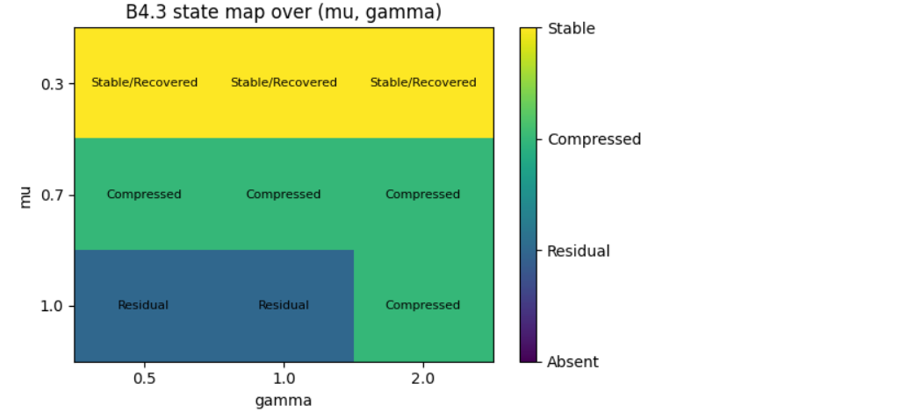

# BIG-B4.3

## Boundary-Layer Stability and Compression under Joint Parameter Variation in Degenerate Mixed-Gradient Dissipative Fields

### Summary

BIG-B4.3 investigates the stability of quadratic boundary layers under simultaneous variation of

- dissipation parameter μ
- quartic-gradient stiffness γ

The study extends BIG-B4.1 from a one-parameter universality scan to a two-parameter boundary-layer map.

### Main Observations

- ν ≈ 2 remains robust across all tested parameter regions.
- Boundary-layer width depends strongly on μ.
- Increasing γ improves amplitude consistency.
- Three numerical regimes emerge:
  - Stable / Recovered
  - Compressed
  - Residual

### Key Numerical Findings

| Regime | Characteristics |
|----------|----------|
| Stable / Recovered | Robust ν≈2 and accurate asymptotic amplitude |
| Compressed | Quadratic layer preserved but width reduced |
| Residual | Quadratic signatures remain but amplitude mismatch persists |

### Main Figures

- Effective exponent map
- Boundary-layer width map
- Relative amplitude error map
- Phase-state map (Stable / Compressed / Residual)

### Status

Completed numerical report.

### DOI

### Related Reports

- BIG-B3.1 — Boundary-Layer Scaling and Quadratic Landing
- BIG-B4.1 — Quadratic Boundary Universality Scan

### Representative Figure

